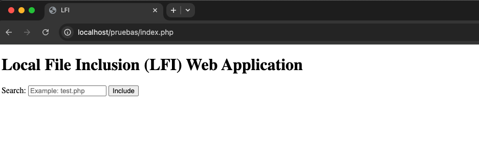
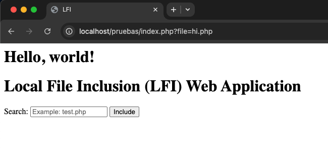
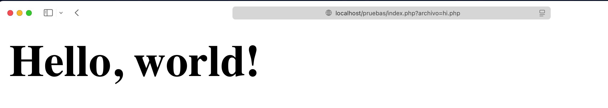
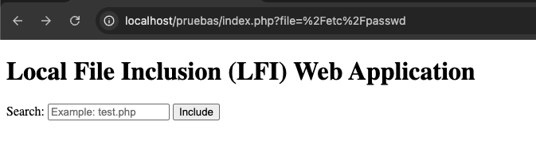
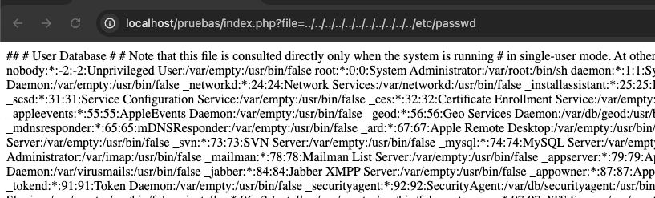
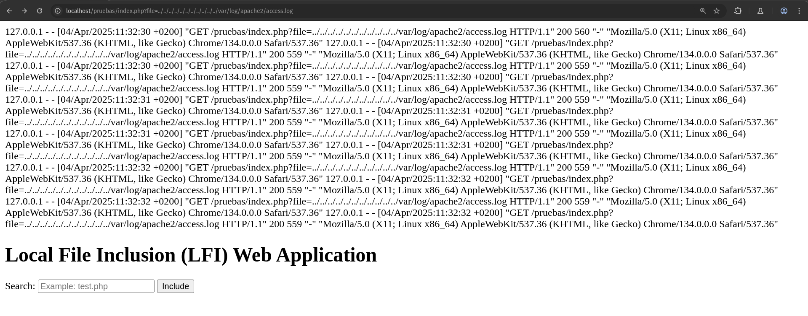

# LFI Uncovered: From Local File Inclusion to Remote Code Execution (RCE)

The Local File Inclusion (LFI) vulnerability is not limited to merely including local files. In the hands of a skilled attacker, it can become a critical attack vector, escalating to a situation of Remote Code Execution (RCE). This article explores how attackers exploit this vulnerability to compromise servers and what measures you can implement to protect your application and infrastructure.

<!-- more -->

## What is Local File Inclusion (LFI)?

The **Local File Inclusion (LFI)** vulnerability occurs when a web server includes local files based on user-provided input. This behavior can be exploited to read files that are not accessible from the client side and cause unexpected behaviors in the application.

## Impact of LFI

LFI vulnerabilities can lead to severe security issues on a web server, including:

- **Unauthorized Access to Sensitive Files and Data Theft**: An attacker can read configuration files and stored credentials on the system.
- **Execution of Malicious Code**: Through advanced techniques, an attacker could execute arbitrary code within the server's context.

### Basic LFI Example

Imagine a web application developed in _PHP_:

<figure markdown="span">
    
    <figcaption>Web Application.</figcaption>
</figure>

We have a search bar where we can look for any file. The web application might use code similar to this:

```php
<?php
  $file = $_GET['file'];
  if (isset($file)){
    include($file);
  }
?>
```

This code expects a `file` parameter containing the file we pass to the search form. If we input a file like `hi.php`, the variable will hold that string, referencing the `hi.php` file in the same directory as the web application file.

If we perform the search, the URL of our web app will change to:

```url
http://domain.com/tests/index.php?file=hi.php
```

<figure markdown="span">
    
    <figcaption>Result of applying basic LFI.</figcaption>
</figure>

As a proof of concept, we attempt to access the file containing user configuration on Linux systems, the `/etc/passwd` file. Since the `file` parameter input is not sanitized, an attacker could write the following in the web application URL:

```url
http://domain.com/tests/index.php?file=/etc/passwd
```

<figure markdown="span">
    
    <figcaption>Accessing the /etc/passwd file.</figcaption>
</figure>

This represents a severe security flaw, not only due to the disclosure of usernames and internal server information but also because the attacker could access other system files, such as service configurations, command history, or SSH keys.

To prevent this, we could sanitize the input received by the `file` parameter:

```php
<?php
  $file = $_GET['file'];
  if (isset($file)){
    include("/var/www/html" . $file);
  }
?>
```

<figure markdown="span">
    
    <figcaption>Restricted access to /etc/passwd.</figcaption>
</figure>

With this change, access to files outside the `/var/www/html` path is restricted, slightly increasing the security of our server. However, this mitigation is not complete, as there are other techniques to bypass this type of mitigation, as we will see below.

### LFI with Path Traversal

Now, consider a more robust web application where basic **LFI** payloads do not work because the web contains this code:

```php
<?php
  $file = $_GET['file'];
  if (isset($file)){
    include("/var/www/html". $file);
  }
?>
```

This protection prevents access to any file outside the specified directory. However, this restriction can be bypassed using **Path Traversal**.

**Path Traversal**, also known as **Directory Traversal**, is a technique to access files and directories outside the directory allowed by the web application. It is achieved using sequences like `../` to move up levels in the file system.

If an application has a filter that only restricts files in its working directory, Path Traversal combined with LFI can be used to access system files. For example:

```url
https://domain.com/tests/index.php?file=../../../../../../../../../../../etc/passwd
```

<figure markdown="span">
    
    <figcaption>Accessing the server's /etc/passwd file.</figcaption>
</figure>

This type of attack is highly dangerous when combined with LFI, as it can allow an attacker to access critical system files, including configurations, credentials, and server activity logs. Additionally, these attacks are often escalated to remote code execution, either by performing a `LogPoisoning` attack or including a `Web Shell` on the server.

### From LFI to RCE (Remote Code Execution)

The transition from a **Local File Inclusion (LFI)** vulnerability to **Remote Code Execution (RCE)** is an advanced technique attackers can use to fully compromise a system. These methods are highly dependent on the language in which the application is written and specific server configurations. The most common methods to escalate from LFI to RCE include:

#### Including Log Files with Code Injection (Log Poisoning)

If the web server logs requests in accessible log files, an attacker can inject malicious code into those logs and then include them via LFI. For example:

1. The attacker sends a malicious request that injects PHP code into the server logs:

```bash
curl -A "<?php system('whoami'); ?>" http://domain.com
```

Here, the PHP code is injected into the web server's log file (e.g., `/var/log/apache2/access.log`).

2. Then, they use LFI to include the log file:

```url
http://domain.com/tests/index.php?file=../../../../../../var/log/apache2/access.log
```

This executes the injected PHP code, allowing the attacker to execute commands on the server.

<figure markdown="span">
    
    <figcaption>Accessing Apache access logs via LFI.</figcaption>
</figure>

As seen at the end of the log, it reflects that we accessed the specified directory. This means the content of the variable provided in the URL has been processed by the server, allowing the attacker to view sensitive information or execute malicious code if the included file contains executable instructions.

Similarly, depending on the log file that can be accessed, code can be injected into web service logs (via the User-Agent, for example), SSH logs (via the username), or even custom application logs through various parameters.

### What Exactly Happens?

- PHP uses `include()` to interpret the specified file.
- When the log is included, it encounters a line containing `<?php system('id'); ?>`.
- PHP executes that line as if it were part of the original code.
- The result of the `id` command is displayed in the HTTP response.

## Including PHP Sessions

When PHP stores session data in files (default configuration), these are saved in a directory defined by `session.save_path` in the `php.ini` file. If an attacker gains access to these files via **Local File Inclusion (LFI)**, they can inject and execute malicious code.

### Attack Flow

1. **Injecting Code into the Session**:  
    The attacker starts a session and modifies its content to include PHP code:

   ```php
   <?php
    session_start();
    $_SESSION['malicious'] = "<?php system('id'); ?>";
   ?>
   ```

   This saves the payload in the session file (e.g., `/var/lib/php/sessions/sess_abc123`).

2. **Exploitation via LFI**:  
    If the server allows including files outside the root directory:  
    `url
    http://domain.com/index.php?file=../../../../var/lib/php/sessions/sess_abc123
    `
   The injected PHP code will execute, allowing commands like `id` to run.

### Why Are Session Files Sensitive?

- **Accessible Location**: By default, PHP stores sessions in directories like `/var/lib/php/sessions` (Linux) or `C:\Windows\Temp` (Windows). If these files are within the web server's reach (e.g., `DocumentRoot`), they could be included via LFI.
- **Storage Format**: Session files contain plaintext data. If the value includes unsanitized PHP code, it will execute when included.

## Mitigations

Preventing vulnerabilities like **Local File Inclusion (LFI)** requires a comprehensive approach combining secure development practices, server configurations, and constant monitoring. Mitigations should not only focus on preventing initial exploitation but also on limiting the impact of a potential attack. Below are key strategies to protect your applications and systems against LFI, its potential escalation to **Remote Code Execution (RCE)**, and the inclusion of PHP sessions.

### Mitigations to Prevent LFI to RCE

To prevent an LFI vulnerability from escalating to RCE, the following measures should be implemented:

1. **Strict Input Validation**:

    Use whitelists to limit the files that can be included, and reject characters like `../` and others that enable Path Traversal.

    - **Whitelists**:

      - **Concept**: Allow only a specific set of files or paths considered safe.
      - **Example**: If your application needs to include only `.php` files from a specific directory, define a whitelist that permits only those files.

      ```php
      <?php
      $allowed_files = [
          'home.php',
          'about.php',
          'contact.php'
      ];

      $file = $_GET['file'];

      if (in_array($file, $allowed_files)) {
          include('/var/www/html/pages/' . $file);
      } else {
          echo "File not allowed.";
      }
      ?>
      ```

      In this example, only the files `home.php`, `about.php`, and `contact.php` can be included. Any other file will be rejected.

    - **Reject Dangerous Characters**:

      - **Concept**: Block characters and sequences that facilitate Path Traversal and other manipulations.
      - **Example**: Remove or reject sequences like `../`, `..\\`, and other special characters.

      ```php
      <?php
      function sanitizePath($input) {
          // Decode URL first to prevent bypass with encoded characters
          $input = urldecode($input);

          // Remove traversal sequences in all their variants
          $input = str_replace(['../', '..\\', '.../', '....//'], '', $input);

          // Remove disallowed characters (only letters, numbers, dashes, and dots)
          $input = preg_replace('/[^a-zA-Z0-9\-\.\/]/', '', $input);

          return $input;
      }

      $file = sanitizePath($_GET['file']);
      $basePath = '/var/www/html/pages/';
      $fullPath = realpath($basePath . $file . '.php');

      // Final validation with realpath()
      if ($fullPath && strpos($fullPath, $basePath) === 0) {
          include($fullPath);
      } else {
          echo "Access denied: Invalid path.";
      }
      ?>
      ```

      Combining proactive sanitization, strict character validation, and `realpath()` checks closes multiple attack vectors. However, whitelists remain the most robust strategy against LFI.

2. **Disable Dangerous Functions**:

    Configure `allow_url_include=Off` and `allow_url_fopen=Off` in `php.ini` and disable functions like `system()`, `exec()`, `shell_exec()`, and similar.

    - **`allow_url_include` and `allow_url_fopen`**:

      - **Concept**: These directives allow including files from remote URLs. Disabling them prevents code inclusion from external sources, reducing the risk of RCE.
      - **Configuration**: In the `php.ini` file, ensure they are set to `Off`:

        ```php
        allow_url_include = Off
        allow_url_fopen = Off
        ```

      - **Disable Critical Functions**:

        - **Concept**: Functions like `system()`, `exec()`, `shell_exec()`, `passthru()`, and `popen()` allow executing system commands. Disabling or restricting their use prevents attackers from executing arbitrary code.
        - **Configuration**: In the `php.ini` file, use the `disable_functions` directive:

        ```php
        disable_functions = system,exec,shell_exec,passthru,popen,proc_open,curl_exec,curl_multi_exec,parse_ini_file,show_source
        ```

        This disables the listed functions, preventing their use in PHP code.

3. **Isolate Sensitive Files**:

    Store configuration files, logs, and sessions outside the directory accessible by the web application.

    - **Concept**: Store configuration files, logs, and sessions outside the web-accessible root directory.
    - **Example**:

      - **Logs**: Save log files in a directory like `/var/log/app/` that is not directly accessible via the web.
      - **Configuration**: Store configuration files in a directory like `/etc/app/` and ensure the web server user does not have read permissions.
      - **Sessions**: Configure PHP to save sessions in a secure directory outside the web server's reach, such as `/var/lib/php/sessions/`.

      In the `php.ini` file:

      ```php
      session.save_path = "/var/lib/php/sessions"
      ```

      Ensure only the system user has access to this directory.

4. **Set Proper Permissions**:

    Restrict read and write permissions on critical files and directories.

    - **Concept**: Restrict read and write permissions on critical files and directories.
    - **Example**:

      - Use `chmod` to set file permissions. For example, for a configuration file:

        ```bash
        chmod 600 /etc/app/config.ini
        chown root:root /etc/app/config.ini
        ```

        This grants read and write permissions only to the root user.

      - **Directories**:

        ```bash
        chmod 700 /var/log/app/
        chown www-data:www-data /var/log/app/
        ```

        This grants read, write, and execute permissions to the `www-data` user (the web server user) and restricts access to others.

5. **Monitor and Audit**:

    Regularly review server logs for suspicious activity and implement intrusion detection systems (IDS) to identify exploitation attempts.

    - **Review Server Logs**:

      - **Concept**: Regularly analyze web server and application logs for suspicious patterns, unusual errors, or attempts to access unauthorized files.
      - **Example**: Look for patterns in logs such as:

        - Attempts to access sensitive files (`/etc/passwd`, configuration files).
        - File inclusion errors.
        - Requests with suspicious characters (`../`).

    - **Implement a WAF (Web Application Firewall)**:

      - **Concept**: Use a web application firewall (WAF) to protect exposed applications from attacks like Path Traversal, code injection, and other common threats.
      - **Example**: Configure a WAF like [ModSecurity](https://modsecurity.org/){:target="\_blank"} or cloud-based services like [Cloudflare](https://www.cloudflare.com/){:target="\_blank"} to filter and block malicious requests.

      These tools are ideal for protecting web applications in internet-exposed environments, providing an additional layer of security.

### Mitigations to Prevent PHP Session Inclusion

1. **Move Session Files Outside the Web Server's Reach**:  
   Configure `session.save_path` in `php.ini` to use a directory not accessible from the web:

```php
session.save_path = "/var/secure/sessions"
```

Ensure permissions: `chmod 600 /var/secure/sessions`.

2. **Strict Validation in LFI**:  
   Use whitelists and path sanitization:

```php
$allowed = ['home', 'about'];
if (!in_array($_GET['file'], $allowed)) die("Access denied");
```

3. **Sanitize Session Data**:  
   Validate and filter inputs before storing them in `$_SESSION`:

```php
$_SESSION['user'] = htmlspecialchars($input);
```

4. **Configure `open_basedir`**:  
   Restrict access to specific directories:

```php
open_basedir = /var/www/html:/var/secure/sessions
```

5. **Use Alternative Storage**:  
   Change the session handler to databases or memory:

```php
ini_set('session.save_handler', 'redis');
ini_set('session.save_path', 'tcp://127.0.0.1:6379');
```

## Conclusion

The Local File Inclusion (LFI) vulnerability serves as a reminder of how poor user input management can become a critical attack vector. While it may seem like a minor flaw, its combination with advanced techniques like Path Traversal or Log Poisoning can quickly escalate to Remote Code Execution (RCE), completely compromising a system's security.

The key to mitigating such vulnerabilities lies in implementing secure development practices, such as strict input validation, the use of whitelists, proper server configuration, and disabling dangerous functions. Additionally, constant monitoring and auditing of systems are essential to detect and prevent exploitation attempts.

Ultimately, security is not a state but a continuous process. Adopting a proactive approach and maintaining a mindset of constant improvement is crucial to protecting your applications and infrastructure against threats like LFI.

Stay safe. Stay smart. Stay secure.

---
