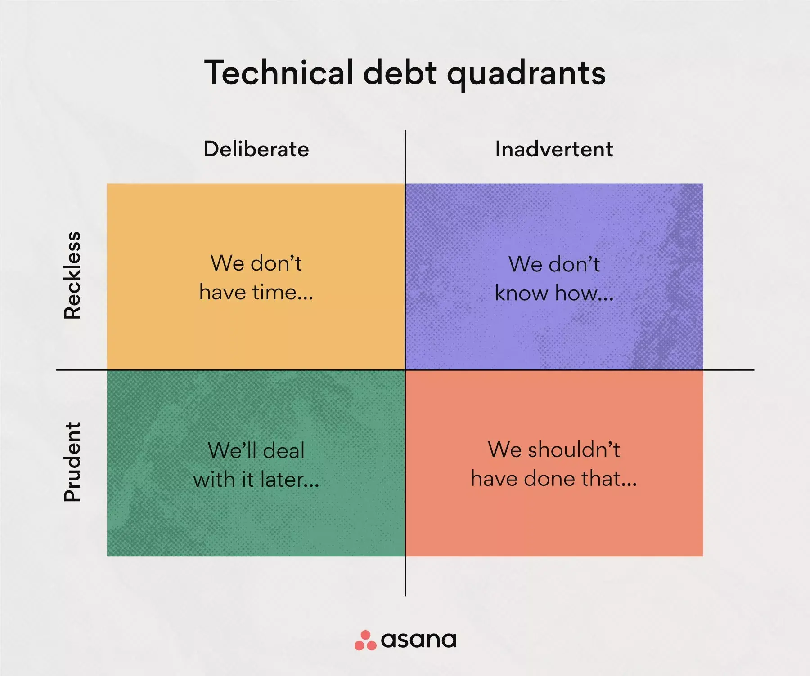

At Atlansec, while we are primarily a cybersecurity company, we also address technical debt from the perspective of secure software development and infrastructure security. Building secure code and robust infrastructures is key to reducing vulnerabilities and ensuring long-term maintainability.

Technical debt is an inevitable enemy that accompanies all software projects to a greater or lesser extent. However, it is not always harmful and, in some cases, can be a necessary strategy to achieve critical objectives within a given timeframe.

<!-- more -->

### **What is technical debt?**

Technical debt represents the cost of fixing suboptimal or poorly implemented code that results from accelerating development to meet deadlines. It is the price paid when speed is prioritized over software quality.

Its origin lies in the need to quickly release new functionalities, often sacrificing fundamental aspects such as maintainability and code clarity. But is it always negative?

### **Is technical debt inherently bad?**

It depends on the context. Accelerating development in a controlled manner to meet a critical deadline is not the same as writing messy code due to ignorance or lack of good practices.

[Asana](https://asana.com) summarizes this concept well into four quadrants of technical debt:

<figure markdown="span">
    
  <figcaption>Asana tech debt quadrant</figcaption>
</figure>

### **The 4 Quadrants of Technical Debt**

1. **Prudent and Deliberate**: The conscious decision to implement a quick solution and deal with the consequences later. This type of debt is acceptable when the risk is low, and the advantages of rapid delivery outweigh the disadvantages.
2. **Reckless and Deliberate**: Having the knowledge and capability to write good code but choosing to prioritize speed without a strategy to mitigate the resulting debt. This approach often leads to long-term problems.
3. **Prudent and Inadvertent**: Trying to produce the best possible code but later discovering a better solution. In this case, the debt is not due to bad practices but rather the natural learning and evolution of the software.
4. **Reckless and Inadvertent**: Debt is generated without awareness, either due to ignorance or lack of experience in good development practices. This type of debt is particularly risky as it can accumulate without the team realizing it.

### **Types of Technical Debt**

##### 1. Intentional

This type of debt is generated when deliberate decisions are made to prioritize functionality delivery, knowing that the code will require improvements in the future. It is common in projects with tight deadlines or when an idea needs to be validated before optimizing the code.

##### 2. Unintentional

It occurs due to errors, lack of knowledge, or poorly written code without the team being aware of the consequences. This debt is often the most dangerous as it can accumulate to an unmanageable level.

### **Examples of Technical Debt**

Technical debt appears in many forms and can arise from various causes. Below are some common examples found in software development projects:

- **Architectural Technical Debt:** A deficient architectural design can lead to significant long-term problems. For example:
  - **Difficult-to-scale monoliths:** A single code block can make scalability and flexibility challenging.
  - **Poor separation of concerns:** A poorly designed architecture can hinder modularity and code reuse.
  - **Excessive dependencies:** High coupling between components makes modifications costly and risky.
  - **Lack of architectural documentation:** Without clear guidance, the team can make decisions that exacerbate technical debt.
- **Insufficient documentation:** Projects with poor or nonexistent documentation can lead developers to misinterpret code purposes, features, or architecture. This creates a knowledge gap, which can accumulate technical debt when incorrect assumptions are made or when new developers struggle to understand the system.
- **Duplicated code:** Redundant code or copying and pasting code in different parts of the system suggests that the team has not adequately considered code reuse opportunities.
- **Outdated libraries or APIs:** If a project relies on outdated libraries or APIs, it will become increasingly difficult to secure, maintain, and expand as those dependencies become unsupported.

### **Impact of Technical Debt**

Technical debt can have a significant impact on software development and business operations. Some negative consequences include:

#### Development Delays

As technical debt accumulates, the time required to implement new features or fix issues increases. The shortcuts taken initially result in greater effort and more time spent later.

#### Higher Maintenance Costs

Maintaining software with technical debt requires more time and resources. Underlying issues must be addressed before additional changes or improvements can be made, increasing long-term operational costs.

#### Lower Software Quality

Technical debt often translates into low-quality code, which can lead to frequent errors and failures. This affects customer satisfaction and the company's reputation.

#### Difficulty in Attracting and Retaining Talent

Skilled developers prefer to work on well-maintained and technically solid projects. Accumulating technical debt can make it harder to hire and retain qualified personnel.

### **How to Manage and Reduce Technical Debt**

At Atlansec, we understand that managing technical debt is crucial to the success of any software project. Therefore, we adopt a proactive approach based on the following strategies:

#### 1. Continuous Refactoring

Adopting a culture of continuous refactoring helps improve code quality without affecting the delivery of new features. Frequent small adjustments can prevent technical debt accumulation.

#### 2. Code Reviews

Code reviews allow problems to be identified before they become debt. Encouraging collaboration among developers ensures better practices and higher code quality.

#### 3. Automating Testing and CI/CD

Using automated testing and continuous integration/deployment (CI/CD) pipelines enables rapid issue detection and prevents the accumulation of unintentional technical debt.

#### 4. Documentation and Best Practices

Writing clear documentation and following established design patterns facilitates code maintainability and reduces the risk of generating debt due to misunderstandings.

#### 5. Planning Technically from the Beginning

Focusing on proper architectural design before development begins can prevent long-term problems. Investing time in planning avoids many rushed decisions that generate debt.

### **Related Links**

- [Asana - Technical Debt](https://asana.com/es/resources/technical-debt)
- [Atlassian - Technical Debt in Agile](https://www.atlassian.com/agile/software-development/technical-debt)
