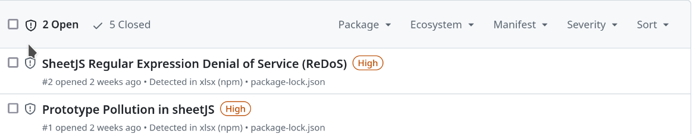
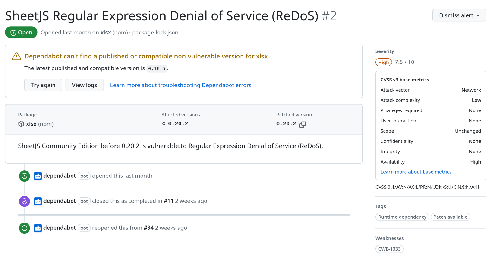

# The day that Dependabot met SheetJS

It all started with a notification from Dependabot a few days ago. While reviewing an internal project repository, I encountered the following message:

<figure markdown="span">
    
  <figcaption>Dependabot alert</figcaption>
</figure>

I proceeded with the **standard Dependabot workflow to address the issues**, as I had assumed it was a routine update. However, I was surprised when the fixes for both vulnerabilities failed because the **required patched version could not be found.**

<!-- more -->

<figure markdown="span">
    
  <figcaption>Dependabot alert for DoS in SheetJS</figcaption>
</figure>
<figure markdown="span">
    
  <figcaption>Dependabot alert for Prototype Pollution on SheetJS</figcaption>
</figure>

After some investigation, I discovered an ongoing conflict between npm and the developers of xlsx, due to an issue with the Multi-Factor Authentication (MFA) token from a few years ago. As a result, **xlsx has dropped out of the npm ecosystem** and is now publishing its packages through other Content Delivery Networks (CDNs) for the distribution of its packages. This has introduced a new level of **complexity**, making it more challenging for users of npm to update packages and **address vulnerabilities** effectively.

Since our application was affected by these vulnerabilities, I decided to dig deeper into them to **assess the risk** of delaying the patch and to explore possible workarounds if necessary, and it was also a good excuse to write an article for the blog, an article that can surely help more than one developer to decide how to deal with the same situation in SheetJS or xlsx. With that in mind, let us analyse the two vulnerabilities reported by the dependanbot in more detail:

## Prototype Pollution in SheetJS aka CVE-2023-30533

This vulnerability in SheetJS allows an attacker to upload a specially crafted file that would **corrupt existing object prototypes** in the application. Prototype pollution could potentially lead to serious problems such as **Remote Code Execution** (RCE), **Cross-Site Scripting** (XSS) or **Denial of Service** (DoS). Depending on the context, this is a significant threat.

Digging around, I found an article written by a researcher at Solid Labs who discovered the vulnerability. Although the article is in Russian and partially behind a paywall, it gives some insight into the context and impact of the vulnerability. On the one hand the risk seems to be limited, on the other hand it confirms that **XSS can be achieved** with this vulnerability, although the proof of concept for the XSS is behind the paywall.

Using the freely available part of the article, I was able to create a basic PoC for prototype pollution with limited impact. This allowed us to test if our application was vulnerable and implement a targeted patch to **sanitise the attack vector** while preparing for a full version update. Also using the PoC and reviewing the commit that patched the vulnerability, I found that the vulnerability occurred when importing a sheet with comments. The root cause seems to be that the **developers didn't anticipate that cell references could be manipulated** by an attacker. Their final solution was to validate that the cell references were legitimate.

Knowing this, we can create a local patch for our library version, but having worked as a pentester for several years, I was curious about how to scale this prototype pollution to XSS. **Reviewing the patch** was the key to finding the XSS vector:

<figure markdown="span">
    
  <figcaption>Commit that fix the XSS</figcaption>
</figure>

We can see that the developers added **escapehtml** to a line in the same commit that fixes the vulnerability. Tracing the code backwards, we can see that the corrected line was only executed when the library was used to parse the XLS to HTML using the make_html_row function. In our case, as we don't use HTML parsing in our application, this vulnerability is not critical as we don't use the vulnerable function. However, we have applied the two patches locally to **improve security** while we prepare for the full update.

Knowing this, developing an exploit to generate a malicious XLSX with an XSS **payload is fairly straightforward**. However, in order not to make it easier to exploit by publishing a proof of concept for a difficult to mitigate vulnerability, I will not publish a working proof of concept for exploiting this XSS in a package that gets about 2.5 million downloads per week.

## SheetJS Regular Expression Denial of Service (ReDoS) (CVE-2024-22363)

This vulnerability allows an attacker to upload a file that causes a **significant delay** in the application by exploiting **regex flaws** in SheetJS. Although not critical to our application, I was interested in replicating the problem and creating a temporary virtual patch until the update was ready.

The first step was to examine the commit in the SheetJS repository. The code revealed several **greedy regex patterns**, in particular the reported one is in the parsing of comments <!--). The researcher provided a PoC demonstrating how to exploit this vulnerability.

We can verify the vulnerability in the following way:

<figure markdown="span">
    
  <figcaption>Proof of Concept for ReDoS</figcaption>
</figure>

While the PoC shows a delay of 42 seconds, the **workload grows exponentially** with larger files. A file ten times its original size would take 4,980 seconds to process - 100 times the delay for only a tenfold increase in content.

In our case, testing the PoC on our development environment showed no noticeable delay, as our application **validates that the file is a real XLS file** before parsing. This validation mitigates the exploitability of the vulnerability in our setup. However, it's still necessary to address the issue as there are more greedy regex in the library.

Two potential solutions were identified:

* Detect exploitation signs before parsing the XLS.
* Update the SheetJS version.

The first option has drawbacks. Checking for exploit patterns via regex may inadvertently introduce a new ReDoS vulnerability, and addressing all problematic regex patterns in the application adds unnecessary complexity.

The second option, while straightforward, is complicated by the fact that the package is no longer part of the npm ecosystem and must be imported manually.

Given these considerations, our team at Atlansec chose the second option and **updated SheetJS** for this application.

## Conclusion

Dependabot's alert on the SheetJS vulnerabilities served as a reminder of the **complexity of dependency management**. Addressing these issues required more than a simple one-click update. To make a good decision, we took a deep dive into the nature of the vulnerabilities, **analysing their impact** on our application and the practicality of the solutions available.

By closely examining the vulnerabilities, Atlansec have developed **on-premises mitigation strategies** that meet the needs of our application. As with most projects, it's not just about fixing alerts, it's about understanding their implications and making decisions that **balance both security and operational needs**. For us, it was a reminder of how vigilance and adaptability can turn dependency challenges into opportunities to **strengthen our application's security posture**. And how important it is to build a security posture into both the development and maintenance of the application, not just from the perspective of an occasional vulnerability test.

---