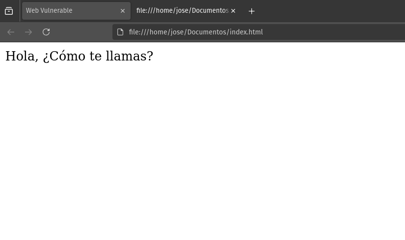

# Cross-Site Scripting: The Invisible Threat on Your Web

**Cross-Site Scripting (XSS) vulnerabilities** are a common and dangerous risk in web application security. They allow attackers to inject malicious JavaScript code into legitimate websites to steal information, manipulate page behavior, or impersonate users. This guide provides a detailed overview of the three main types of XSS: **Stored XSS**, **Reflected XSS**, and **DOM-Based XSS**, explaining how they occur, how they are exploited, and how to prevent them.

In the context of web applications, XSS enables the injection of JavaScript code into legitimate sites. This can be leveraged to exfiltrate information from other users, manipulate page behavior, or perform actions within the application under the guise of a user's session. In desktop applications, such vulnerabilities can lead directly to arbitrary code execution on the victim's machine.

This article delivers an in-depth examination of the three primary types of XSS attacks: **Stored XSS**, **Reflected XSS**, and **DOM-Based XSS**, detailing how they manifest, how they are exploited, and the measures that can be implemented to thwart them.

## What is it Used For?

Cross-Site Scripting (XSS) attacks can be primarily utilized for:

-   **Session Cookie Theft:** Allowing attackers to impersonate legitimate users and gain unauthorized access to their accounts.
-   **Identity Spoofing:** Enabling attackers to perform unauthorized actions on behalf of the victim, such as altering passwords or executing fraudulent transactions.
-   **Phishing:** Crafting deceptive pages or forms to dupe users into divulging their credentials.
-   **Defacement:** Altering the appearance of websites to display malicious content or damage the organization's reputation.
-   **Keylogging:** Recording keystrokes to steal passwords and other sensitive information.
-   **Browser Exploits:** Taking advantage of vulnerabilities in the victim's browser to execute malicious code.
-   **Circumventing Access Controls:** Bypassing security restrictions such as CSRF (Cross-Site Request Forgery) token validation.

## How are They Exploited?

Attackers typically adhere to the following steps to exploit XSS vulnerabilities:

1.  **Vulnerability Identification:** Scouring for entry points where JavaScript code can be injected, such as URL parameters or form fields.
2.  **Payload Creation:** Developing a malicious script designed to execute the desired action.
3.  **Payload Injection:** Inserting the malicious code into the web application, exploiting the absence of proper sanitization.
4.  **Attack Delivery:**
    - For Reflected XSS: Deceiving the victim into accessing a malicious link or submitting a manipulated form.
    - For Stored XSS: The attack is triggered automatically when users access the compromised page.

## Why Does it Occur?

XSS vulnerabilities commonly arise due to:

- **Inadequate Code Sanitization:** Failing to properly validate user-supplied data or escape special HTML characters.
- **Lack of Encoding:** Not performing correct encoding when inserting data into different contexts (HTML, JavaScript, URL).

This type of vulnerability isn't intrinsically linked to any specific programming language; however, for the sake of clarity in the examples, we will focus on PHP and JavaScript.

## Stored XSS: The Time Bomb in Your Database

*Stored XSS*, also known as **Persistent XSS**, occurs when a web application stores attacker-supplied data (containing malicious code) in its database. This code is then inserted into web pages served to other users, affecting anyone who visits the compromised page. Forums, product reviews, and comment sections are the most frequent targets.

### Vulnerable PHP Code and Solution

In this instance, we observe that when a **POST** request (data submission) is made, the data input is not sanitized:

```php
<?php
//Guarda los comentarios de los usuarios
$comentario = $_POST['comentario'];
mysqli_query($conn,"INSERT INTO comentarios (comentario) VALUES ('$comentario')");
//Mostramos los comentarios
$resultado = mysqli_query($conn, "SELECT comentario FROM comentarios");
while($row = mysqli_fetch_assoc($resultado)){
  echo $row['comentario'];
}
?>
```
The `$comentario` variable stores the user input without prior sanitization, thereby presenting an opportunity for the attacker to introduce any payload.

When the comments are displayed, the payload will be interpreted within the browser context of any victim who visits the website.

A potential mitigation is as follows:

```php
<?php
// Conexión a la base de datos (ajusta las credenciales)
$conn = new mysqli("localhost", "usuario", "contraseña", "basedatos");

// Verifica la conexión
if ($conn->connect_error) {
    die("Error de conexión: " . $conn->connect_error);
}

// Verifica si se ha enviado un comentario
if ($_SERVER["REQUEST_METHOD"] === "POST" && isset($_POST['comentario'])) {
    // Eliminamos espacios en blanco al inicio y al final
    $comentario = trim($_POST['comentario']); 

    // Evitar SQL Injection con prepared statements
    $stmt = $conn->prepare("INSERT INTO comentarios (comentario) VALUES (?)");
    $stmt->bind_param("s", $comentario);
    $stmt->execute();
    $stmt->close();
}

// Mostramos los comentarios de forma segura
$resultado = $conn->query("SELECT comentario FROM comentarios");
while ($row = $resultado->fetch_assoc()) {
    echo htmlspecialchars($row['comentario'], ENT_QUOTES, 'UTF-8') . "<br>";
}

// Cerramos la conexión
$conn->close();
?>
```

Data insertion has been protected through the use of **Prepared Statements** in *PHP*, and comment output via `htmlspecialchars`.

- **Prepared Statements:** Prevent **SQL Injection** by separating data from the SQL query, ensuring that user input is treated as a value and not as part of the SQL code.
- `htmlspecialchars`: Ensures that all special characters are converted to their corresponding HTML entities, preventing **XSS** attacks.

!!! Danger
    We do not utilize `mysqli_real_escape_string` because it does **NOT** protect against SQL Injection on its own, as it depends on the `set_charset()` configuration. Consulting the [official documentation](https://www.php.net/manual/es/mysqli.real-escape-string.php){:target="_blank"} reveals a warning that if the encoding is not set correctly, escaping special characters may not function as expected, potentially allowing injection attacks in some configurations.

### Vulnerable JavaScript Code and Solution

Numerous frameworks exist for implementing a backend with JavaScript, but the syntax remains similar across them.

The following example in **Node.js** illustrates a **Cross-Site Scripting (XSS)** vulnerability in the generation of dynamic content:

```javascript
app.get('/comments', (req, res) => {
  let html = '<ul>';
  for (const comentario of comments) {
    html += `<li>${comentario}</li>`;
  }
  html += '</ul>';
  res.send(html);
});
```

This code lists comments in the "*comments*" section of the application but does not escape special characters in the `${comentario}` variable, thereby enabling the injection of HTML and the execution of arbitrary JavaScript code.

To prevent **XSS attacks**, special characters must be sanitized before rendering the content on the frontend. Consequently, this code can be improved by sanitizing special characters using functions like `sanitizeHtml()`:

```javascript
const sanitizeHtml = require('sanitize-html');
app.get('/comments', (req, res) => {
  let html = '<ul>';
  for(const comentario of comments){
    const ComentarioSaneado = sanitizeHtml(comentario);
    html += `<li>${ComentarioSaneado}</li>`;
  }
  html += '</ul>';
  res.send(html);
});
```
!!! Warning
    Various libraries such as `DOMPurify`, `sanitize-html`, or `isomorphic-dompurify` can be employed to patch **XSS** vulnerabilities, contingent on whether you are working on the frontend or backend.
  
  - `DOMPurify`: Purifies **HTML in frontend applications**, eliminating malicious code.
  - `sanitize-html`: Ideal for the backend, sanitizes **HTML by removing dangerous tags** and **attributes**.
  -`isomorphic-dompurify`: A version of **DOMPurify** that functions both on the **frontend** and in the **backend**.

In the preceding example, we utilized `sanitize-html` because we are operating in a **Node.js** environment.

## Reflected XSS: The Opportunistic Attack

Having examined *Stored XSS*, **Reflected XSS** attacks occur solely on the client-side. These vulnerabilities often arise from the **manipulation of URLs** or **forms**. In these instances, the attacker must resort to social engineering techniques or vulnerability chaining to inject the payload into the victim's context.

### Vulnerable PHP Code and Solution

In this case, the vulnerability exists due to the failure to sanitize the query parameter before incorporating it into the HTML to be rendered:

```php
<?php
$search_query = $_GET['query'];
echo "<p>Has buscado: $search_query</p>";
?>
```

If we have the following URL `http://url/search?query=search_result`, and we replace `search_result` with `<script>alert("Hello");</script>`, the injected script will be reflected in the page since HTML entities are not being sanitized. The solution could again involve the use of `htmlspecialchars`.

### Vulnerable JavaScript Code and Solution

As with *Stored XSS*, we will use an example of a web application implemented with the **Node.js** framework.

This application contains the following code snippet:

```javascript
const express = require('express');
const app = express();

app.get('/search', function(req, res){
  var searchTerm = req.query.query;
  res.send('Has buscado: ' + searchTerm);
});

app.listen(80);
```

We observe that the content of the `query` variable, which appears in the URL `http://url/search?query=search_result`, is obtained. This data input lacks any sanitization, leading to a *Reflected XSS* vulnerability. As with the case of Stored XSS, this can be resolved with libraries such as `sanitize-html` or `DomPurify`.

## DOM-Based XSS: The Invisible Danger on the Client

**DOM-Based XSS** is a web security vulnerability that occurs on the client-side, *without requiring the server to reflect the attack payload directly in the response*. It is exploited by manipulating the Document Object Model (DOM) in the user's browser.

### What is the DOM?

The **DOM (Document Object Model)** is a programming interface that represents a web document as a tree structure. It allows scripts, such as JavaScript, to dynamically access and modify the content, structure, and style of a web document.

The structure of the **DOM** is composed of:

- HTML elements (nodes)
- Attributes of elements
- Text within elements
- Comments

### Methodology of DOM-Based XSS Attacks

The attacker injects a malicious script that executes in the client's browser by manipulating the DOM. The general process is:

1.  **Vulnerability Identification:** The attacker finds a point in the client-side JavaScript code where data controlled by the attacker (e.g., URL parameters) are used to modify the DOM in an insecure manner. This involves identifying both the **source** of the data (where attacker-controlled data enters) and the **sink** (where the data is used dangerously to manipulate the DOM).
2.  **Creation of the Malicious URL:** A URL is created containing malicious JavaScript code, typically as part of a parameter or URL fragment. *The payload is placed in a data source controllable by the attacker*.
3.  **Victim Deception:** The victim is tricked into accessing the malicious URL through phishing, shortened links, etc.
4.  **Execution in the Browser:** The victim's browser loads the page and executes the legitimate JavaScript code of the application.
5.  **DOM Manipulation:** The legitimate code, using data from the malicious URL, modifies the DOM, inserting the malicious script. *The key is that the sink receives contaminated data from the source and uses it to modify the DOM insecurely*.
6.  **Execution of the Malicious Script:** The injected script executes in the context of the web page, allowing the attacker to perform actions such as stealing cookies, manipulating the page, redirects, or even exfiltrating sensitive data.

### Common Sources of DOM XSS

The most common data sources include:

1.  **`window.location`**: This object contains information about the current URL of the document. It is very useful for obtaining different parts of the URL.

    - **`window.location.hash`**: Returns the fragment of the URL (the part after the `#`), which is often used for single-page navigation.
    - **`window.location.search`**: Returns the query string of the URL (the part after the `?`), which contains parameters that can be used by the server or the client.
    - **`window.location.pathname`**: Returns the path of the URL (the part after the domain), which indicates the location of the resource on the server.
2.  **`document.referrer`**: This attribute returns the URL of the page from which the user arrived at the current page. It is useful for tracking where visitors come from.
3.  **`document.URL`**: Returns the complete URL of the current page. It is similar to `window.location.href` and can be used to obtain the complete URL in a single call.
4.  **Cookies**: Cookies are small pieces of data stored in the user's browser. They are used to remember information between sessions, such as authentication data, user preferences, and more. In JavaScript, they can be accessed and manipulated using `document.cookie`.

These data sources are common in web development and are used to obtain information about user navigation and application state.

!!! Reminder
    These sources are controllable by the attacker in some way.

### Common Sinks of DOM XSS

**Sinks** are potentially dangerous *functions* or *DOM objects* in JavaScript that can cause unwanted effects if passed data controlled by an attacker.

According to [PortSwigger](https://portswigger.net/web-security/cross-site-scripting/dom-based){:target="_blank"}, some of the most common sinks that lead to DOM XSS include:

- `document.write()`: Writes HTML text directly into the document. Primarily used during page loading.
- `document.writeln()`: Similar to `document.write()`, but appends a newline after the text.
- `document.domain`: A property that returns or sets the domain.

<figure markdown="span" style="width:30%;">
  
  <figcaption>DOM Structure</figcaption>
</figure>

### Methodology of DOM-Based XSS Attacks

The attacker injects a malicious script that executes in the client's browser by manipulating the DOM. The general process is:

1. **Vulnerability Identification:** The attacker finds a point in the client-side JavaScript code where data controlled by the attacker (e.g., URL parameters) are used to modify the DOM in an insecure manner. This involves identifying both the **source** of the data (where attacker-controlled data enters) and the **sink** (where the data is used dangerously to manipulate the DOM).
2. **Creation of the Malicious URL:** A URL is created containing malicious JavaScript code, typically as part of a parameter or URL fragment. *The payload is placed in a data source controllable by the attacker*.
3. **Victim Deception:** The victim is tricked into accessing the malicious URL through phishing, shortened links, etc.
4. **Execution in the Browser:** The victim's browser loads the page and executes the legitimate JavaScript code of the application.
5. **DOM Manipulation:** The legitimate code, using data from the malicious URL, modifies the DOM, inserting the malicious script. *The key is that the sink receives contaminated data from the source and uses it to modify the DOM insecurely*.
6. **Execution of the Malicious Script:** The injected script executes in the context of the web page, allowing the attacker to perform actions such as stealing cookies, manipulating the page, redirects, or even exfiltrating sensitive data.

### Common Sources of DOM XSS

The most common data sources include:

1. **`window.location`**: This object contains information about the current URL of the document. It is very useful for obtaining different parts of the URL.

    - **`window.location.hash`**: Returns the fragment of the URL (the part after the `#`), which is often used for single-page navigation.
    - **`window.location.search`**: Returns the query string of the URL (the part after the `?`), which contains parameters that can be used by the server or the client.
    - **`window.location.pathname`**: Returns the path of the URL (the part after the domain), which indicates the location of the resource on the server.
2.  **`document.referrer`**: This attribute returns the URL of the page from which the user arrived at the current page. It is useful for tracking where visitors come from.
3.  **`document.URL`**: Returns the complete URL of the current page. It is similar to `window.location.href` and can be used to obtain the complete URL in a single call.
4.  **Cookies**: Cookies are small pieces of data stored in the user's browser. They are used to remember information between sessions, such as authentication data, user preferences, and more. In JavaScript, they can be accessed and manipulated using `document.cookie`.

These data sources are common in web development and are used to obtain information about user navigation and application state.

!!! Reminder
    These sources are controllable by the attacker in some way.

### Sinks Comunes de DOM XSS
**Sinks** are potentially dangerous *functions* or *DOM objects* in JavaScript that can cause unwanted effects if passed data controlled by an attacker.
According to [PortSwigger](https://portswigger.net/web-security/cross-site-scripting/dom-based){:target="_blank"}, some of the most common sinks that lead to DOM XSS include:

- `document.write()`: Writes HTML text directly into the document. Primarily used during page loading.
- `document.writeln()`: Similar to `document.write()`, but appends a newline after the text.
- `document.domain`: A property that returns or sets the domain of the current page.
- `element.innerHTML`: Property that sets or returns the HTML content of an element.
- `element.outerHTML`: Property that sets or returns the complete HTML of the element, including the element itself.
- `element.insertAdjacentHTML()`: Method that inserts a text HTML at a specific position relative to the element.
- `element.onevent`: (e.g., `onclick`, `onload`): Properties that assign functions to specific events of the element.
- `eval()`: Function that evaluates JavaScript code represented as a text string.

Also, certain *jQuery* functions can be problematic:

- `add()`, `after()`, `append()`, `animate()`, `before()`, `html()`, `prepend()`, `replaceAll()`, `replaceWith()`, `wrap()`, `wrapInner()`, `wrapAll()`.
- `attr()` (if used with unsanitized data)
- `$()` (selector, especially with location.hash)

!!! Reminder
    It is crucial to bear in mind that it is not sufficient for a **source** and a **sink** to be present in the code. There must be an executable data flow from the source to the sink for the vulnerability to be exploitable.

### Vulnerable Code and Solution

We have the following web page:

<figure markdown="span">

<figcaption>Initial Website</figcaption>
</figure>

At first glance, we don't see anything relevant, but if we inspect the source code of it, we see the following:

```html
<!DOCTYPE html>
<html>
  <head>
     <title>Web Vulnerable</title>
     </head> 
  <body>
    <div id="saludo"></div>
    <script> 
      //Obtenemos el parámetro nombre de la URL
      const nombre = new URLSearchParams(window.location.search).get('nombre');
      if(nombre == null){
        document.write("Hola, ¿Cómo te llamas?");
      }else{
        //Mostramos los resultados de manera no sanitizada
        document.write("Hola " + nombre + ", ¿Qué tal?");
      }
    </script>
  </body>
</html>
```

Here, `window.location.search` is the source, and `document.write()` is the sink.

As we can see, the web page is making use of the function `document.write()`, which inserts a parameter `nombre` without previous validation or sanitization. Thus, since by default that parameter is null, we see that the web shows us what is contained in the `if`; however, if we pass a name as a parameter in the URL, we have:

<figure markdown="span">
  
    <figcaption>Web URL modificada</figcaption>
</figure>

As a result, we have that the name introduced as a parameter to the URL is reflected on the web page. Since the input of the username is not sanitized, we can try to inject *JavaScript* code to check if the web is susceptible to XSS; *Spoiler: It is*.

<figure markdown="span">
  
    <figcaption>Website vulnerable to DOM-Based XSS</figcaption>
</figure>

As we see, the script was executed and showed the alert, since it is susceptible to XSS; therefore, a way to be able to remedy this vulnerability would be:

```html
<!DOCTYPE html>
<html>
  <head>
     <title>Web Vulnerable</title>
     </head> 
  <body>
    <div id="saludo"></div>
    <script> 
      //Obtenemos el parámetro nombre de la URL
      const nombre = encodeURIComponent(new URLSearchParams(window.location.search).get('nombre'));
      if(nombre == null){
        document.write("Hola, ¿Cómo te llamas?");
      }else{
        //Mostramos los resultados de manera no sanitizada
        document.write("Hola " + nombre + ", ¿Qué tal?");
      }
    </script>
  </body>
</html>
``` 

If now we inject malicious *JavaScript* code again, we will have the following result:

<figure markdown="span">
  
    <figcaption>DOM-Based XSS vulnerability solved</figcaption>
</figure>

As we see, if we make use of the method `encodeURIComponent`, which performs a sanitization of the special characters that the query parameter may have, and we also insert this content via `textContent`.

It should also be noted that we can make use of **DOMPurify** to sanitize dynamic content in web applications. **DOMPurify** is a *JavaScript* library that purifies HTML and removes any malicious code, providing an additional layer of security against XSS attacks. It is especially useful in frontend applications where the DOM is manipulated directly.

```javascript
const DOMPurify = require('dompurify');
app.get('/comments', (req, res) => {
  let html = '<ul>';
  for(const comentario of comments){
    const ComentarioSaneado = DOMPurify.sanitize(comentario);
    html += `<li>${ComentarioSaneado}</li>`;
  }
  html += '</ul>';
  res.send(html);
});
```

In this example, we use **DOMPurify** to clean the comments before inserting them into the DOM, ensuring that any potentially dangerous content is neutralized.


## Conclusion

XSS vulnerabilities are a serious risk for the security of web applications. However, by implementing the prevention measures described in this article, it is possible to protect web applications against XSS attacks.
In a future post, we will delve into the particularities and consequences of XSS vulnerabilities in mobile and desktop applications, where the impact of a successful exploitation can be even greater.

In summary, the keys to prevent XSS are:

- Validate and sanitize user input data.
- Escape output data in the appropriate context.
- Perform periodic security audits.
- Train developers in web security best practices.

In a future post, we will delve into the particularities and consequences of XSS vulnerabilities in mobile and desktop applications, where the impact of a successful exploitation can be even greater.

### Additional Resources
-   [OWASP Cross-Site Scripting (XSS)](https://owasp.org/www-project-top-ten/OWASP_Top_Ten_2017/Top_10-2017_A7-Cross-Site_Scripting_(XSS)){:target="_blank"}
-   [PortSwigger Web Security Academy](https://portswigger.net/web-security/cross-site-scripting){:target="_blank"}

---
