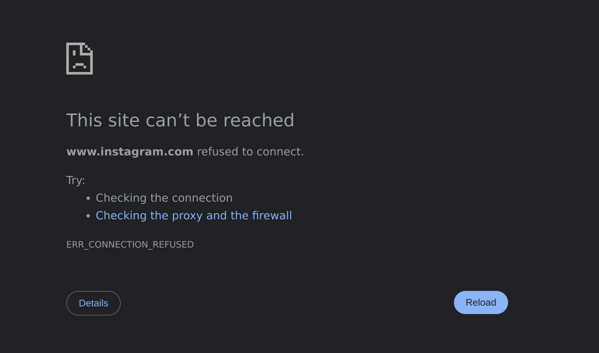

Understanding the **DNS (Domain Name System)** is essential for anyone interested in how the internet works. DNS plays a crucial role in translating human-friendly domain names into machine-readable IP addresses, ensuring seamless web navigation.

This guide walks you through:

- The **hierarchical structure of DNS** and its key components.
- **Types of DNS queries** and how they function.
- **DNS security** concerns and protective measures such as **DNSSEC**.
- **Setting up a local DNS server** using BIND9 for improved **performance**, **privacy**, and **content filtering**.


So, if you want to take your knowledge to the next level and discover how this hierarchical system ensures that every page you visit is just a click away, read on.

<!-- more -->

## **The Basics: What Does a DNS Do?**

When you enter a domain name into your browser, your computer doesn’t understand that name directly. Instead, your device initiates a process called **name resolution** to find the corresponding IP address. DNS servers handle this resolution through a structured, hierarchical system.

## **The Hierarchy of DNS Servers**

<figure markdown="span">
    { width="550" }
  <figcaption>Hierarchy of DNS Servers for Google</figcaption>
</figure>

The DNS operates as a **distributed, hierarchical system**. Each level in this hierarchy plays a specific role in translating domain names into IP addresses. Here’s how it works:

#### **Recursive Resolver (Your DNS Query Starts Here)**

- When you type a URL in your browser, your device sends a request to a **recursive resolver**. This is usually provided by your Internet Service Provider (ISP) or a third-party service such as Google Public DNS or Cloudflare.
- The recursive resolver's job is to handle your query and fetch the correct IP address by contacting other DNS servers on your behalf.

#### **Root DNS Servers (The Starting Point)**

- If the recursive resolver doesn’t already have the IP address cached, it contacts one of the **13 root DNS servers** distributed globally.
- These servers don’t store specific domain-to-IP mappings but point to the next level in the hierarchy: **Top-Level Domain (TLD) servers**.

#### **Top-Level Domain (TLD) Servers**

- TLD servers manage domains based on their suffix, such as `.com`, `.org`, or `.net`. For instance, if you’re visiting `google.com`, the root server will direct your query to the `.com` TLD server.
- The TLD server then provides the address of the **authoritative name server** for the requested domain.

#### **Authoritative Name Server**

- The authoritative name server is the final step in the chain. It **holds the actual DNS records** for the domain, including the IP address of the web server.
- For Google, if you’re looking for `google.com`, the authoritative server will return its corresponding IP address (e.g., `8.8.8.8`).

#### **Returning the Answer**

- Once the recursive resolver gets the IP address from the authoritative server, it sends it back to your browser. Your browser can then use the IP address to connect to the website’s server and load the page.


## **Types of DNS Queries**

During this process, there are three main types of DNS queries:

1. **Recursive Query:** The resolver takes full responsibility for finding the IP address and returns it to the client.
2. **Iterative Query:** The resolver queries each DNS server in sequence, receiving referrals to the next server until it finds the IP address.
3. **Non-Recursive Query:** If the resolver already has the requested information cached, it immediately returns the result.


## **DNS Records: The Building Blocks**

The authoritative name server stores different types of **DNS records** that contain specific information about a domain. Some of the most common records include:

- **A Record:** Maps a domain to an IPv4 address.
- **AAAA Record:** Maps a domain to an IPv6 address.
- **CNAME Record:** Points a domain to another domain (used for aliases).
- **MX Record:** Specifies mail servers for email delivery.
- **TXT Record:** Provides additional information about a domain, often used for verification.


## **DNS Caching: Speeding Things Up**

To improve performance and reduce the load on DNS servers, caching is used at various levels:

- **Browser Cache:** Your browser temporarily stores DNS responses for domains you visit frequently.
- **Operating System Cache:** Your device’s operating system also caches DNS responses to avoid redundant queries.
- **Resolver Cache:** The recursive resolver keeps a cache of recently queried domains to speed up future lookups.

Caching ensures that most DNS queries don’t need to traverse the entire hierarchy, making internet browsing faster and more efficient.

To observe how DNS caching reduces response times, let's use the **dig** command paying attention to the ***Query Time*** for **google** domain:

In the first trial we got:

``` bash
; <<>> DiG 9.18.28-1~deb12u2-Debian <<>> google.com
;; global options: +cmd
;; Got answer:
;; ->>HEADER<<- opcode: QUERY, status: NOERROR, id: 25335
;; flags: qr rd ra; QUERY: 1, ANSWER: 1, AUTHORITY: 0, ADDITIONAL: 1

;; OPT PSEUDOSECTION:
; EDNS: version: 0, flags:; udp: 1232
;; QUESTION SECTION:
;google.com.                    IN      A

;; ANSWER SECTION:
google.com.             215     IN      A       142.250.200.142

;; Query time: 68 msec
```

And in the second time, we got:

```bash
; <<>> DiG 9.18.28-1~deb12u2-Debian <<>> google.com
;; global options: +cmd
;; Got answer:
;; ->>HEADER<<- opcode: QUERY, status: NOERROR, id: 44597
;; flags: qr rd ra; QUERY: 1, ANSWER: 1, AUTHORITY: 0, ADDITIONAL: 1

;; OPT PSEUDOSECTION:
; EDNS: version: 0, flags:; udp: 1232
;; QUESTION SECTION:
;google.com.                    IN      A

;; ANSWER SECTION:
google.com.             287     IN      A       142.250.200.78

;; Query time: 36 msec
```

As we can see, the time has decreased.

## **DNS Security**

Despite its importance, the DNS system has vulnerabilities that can be exploited by attackers. Some common issues include:

- **DNS Spoofing/Poisoning:** Malicious actors inject false DNS records into a cache, redirecting users to fraudulent websites.
- **DDoS Attacks:** This is one of the most well-known attacks consisting on flooding DNS servers with traffic to disrupt service.
- **Man-in-the-Middle Attacks:** Intercepting DNS queries to modify responses.

To combat these threats, technologies like **DNSSEC (Domain Name System Security Extensions)** add cryptographic signatures to DNS records, ensuring their authenticity. Imagine you want to visit google.com:

1. Your browser requests the IP address for google.com from a recursive resolver.
2. The resolver checks the DNSSEC signatures at each level (root, .com, and google.com).
3. If all signatures are valid, the resolver returns the IP address.
4. If any signature fails, the resolver knows the data has been tampered with and discards it.


## **Setup a Local DNS for Privacy and Performance purposes**

If you've made it this far, congratulations! You now understand the basics and key principles of DNS servers. With this knowledge, you're ready to roll up your sleeves and set up your own local DNS server. Doing so opens up a world of possibilities: you can filter unwanted content across your network, enhance browsing performance, and even navigate the internet more securely, minimizing the risk of viruses and other online threats.

### Bind9

In this article, we'll use the **BIND9 DNS server** to set up a DNS server directly on our computer. This hands-on approach will let us experience what it’s like to have a fully functional DNS server running within our own network—right from the comfort of our own machine!

Let's first install **bind9**:

```bash
sudo apt update
sudo apt install bind9 dnsutils
```

Configure your system to first ask the local DNS server that we have installed:

```bash
sudo nano /etc/resolv.conf
```

Add the local server as the first line.

```bash
nameserver 127.0.0.1
```

After that, we will edit the configuration file:

```bash
sudo nano /etc/bind/named.conf.options
```

Remove everything in that file and add the following:

```bash
acl "trusted" {
    192.168.0.0/16;
    localhost;
};

options {
    directory "/var/cache/bind";

    recursion yes;
    allow-query { trusted; };

    forwarders {
        1.1.1.3;
        1.1.1.2;
    };

    dnssec-validation auto;

    listen-on { any; };
    listen-on-v6 { any; };
};
```

This **ACL specifies which clients are considered "trusted"** and can interact with the DNS server.

The options block contains global settings for the BIND9 server. Let’s go through each line:

- `directory "/var/cache/bind";` This specifies the directory where BIND will store its cache and related files.

- `recursion yes;` Enables recursive queries, meaning the server will resolve DNS queries on behalf of clients by querying other DNS servers if it doesn’t have the answer cached or locally configured.

- `allow-query { trusted; };` Restricts which clients can send queries to the server. Only clients defined in the trusted ACL (local network and localhost) are allowed to query this DNS server.

- `forwarders { 1.1.1.3; 1.1.1.2; };` Defines external DNS servers (in this case, Cloudflare's filtered DNS servers) to which the server will forward queries it cannot resolve locally. The server acts as an intermediary, forwarding unresolved queries to these upstream servers.
    - 1.1.1.3: Blocks malicious content.
    - 1.1.1.2: Blocks malware-related content.

- `dnssec-validation auto;` Enables DNSSEC validation automatically, ensuring the authenticity and integrity of DNS responses using cryptographic signatures.

With this configuration, we’ve implemented basic security measures by trusting Cloudflare's DNS servers to handle forwarded queries, ensuring that responses are filtered to **avoid malicious domains**.

We can check our performance improvement by doing the same as before, using the **dig** command to look for the ***Query Time*** of **google.com** domain.

```bash
; <<>> DiG 9.18.28-1~deb12u2-Debian <<>> google.com
;; global options: +cmd
;; Got answer:
;; ->>HEADER<<- opcode: QUERY, status: NOERROR, id: 56385
;; flags: qr rd ra; QUERY: 1, ANSWER: 1, AUTHORITY: 0, ADDITIONAL: 1

;; OPT PSEUDOSECTION:
; EDNS: version: 0, flags:; udp: 1232
; COOKIE: 2b2a789af74949000100000067966b06329ed55c149fd975 (good)
;; QUESTION SECTION:
;google.com.                    IN      A

;; ANSWER SECTION:
google.com.             300     IN      A       142.250.200.142

;; Query time: 67 msec
;; SERVER: 127.0.0.1#53(127.0.0.1) (UDP)
;; MSG SIZE  rcvd: 83
```

After the second query, we achieve a **0ms** response time, as our local DNS server efficiently retrieves the result from its cache.

```bash
; <<>> DiG 9.18.28-1~deb12u2-Debian <<>> google.com
;; global options: +cmd
;; Got answer:
;; ->>HEADER<<- opcode: QUERY, status: NOERROR, id: 51691
;; flags: qr rd ra; QUERY: 1, ANSWER: 1, AUTHORITY: 0, ADDITIONAL: 1

;; OPT PSEUDOSECTION:
; EDNS: version: 0, flags:; udp: 1232
; COOKIE: a2419e6c5e03859d0100000067966b096b0ad0c0a30e2273 (good)
;; QUESTION SECTION:
;google.com.                    IN      A

;; ANSWER SECTION:
google.com.             297     IN      A       142.250.200.142

;; Query time: 0 msec
;; SERVER: 127.0.0.1#53(127.0.0.1) (UDP)
;; MSG SIZE  rcvd: 83
```

We can see that the SERVER we are asking is `127.0.0.1` as it is our **bind9** DNS server.

However, what if we want to take things a step further and enforce our own restrictions? Whether it’s for enhanced security, blocking specific websites, or creating a safer internet environment for children, we can configure BIND9 to restrict access to a custom list of domains. This gives us full control over what content is allowed or denied on our network, tailoring the DNS server to meet our specific needs.

### Blocking specific domains using BIND9

To block specific domains using BIND9, you can create a **custom zone file** that redirects queries for those domains to an invalid or non-existent address, effectively blocking access.

Here's a step-by-step guide:

#### Create a Zone File for Blocked Domains

A zone file defines the DNS records for the domains you want to block. These records can redirect the blocked domains to a <<blackhole\>\> (e.g., `127.0.0.1` or `0.0.0.0`).

1. Create a new zone file for blocking domains, for example, `block_instagram.zone`:
```bash
sudo nano /etc/bind/block_instagram.zone
```
2. Add the following content to the zone file:

```bash
$TTL    3600
@       IN      SOA     localhost. root.localhost. (
                2025012601 ; Serial
                3600       ; Refresh
                1800       ; Retry
                604800     ; Expire
                86400 )    ; Minimum TTL
        IN      NS      localhost.

@       IN      A       127.0.0.1
*       IN      A       127.0.0.1
```

- ***127.0.0.1***: Redirects queries for the blocked domains to the local machine, effectively preventing access.

- **Wildcard Record (** IN A*)**: Ensures any subdomain of the blocked domain is also redirected.

#### Define the Blocked Domains in `named.conf.local`

We are going to block **Instagram**. You need to associate the blocked domains with the custom zone file.

1. Open the BIND9 configuration file:
```bash
sudo nano /etc/bind/named.conf.local
```

2. Add a *zone* entry for each domain you want to block. In this case we will block ***instagram.com*** and ***cdninstagram.com***, Instagram's content delivery network (CDN) domain used for serving images and videos:
```bash
zone "instagram.com" {
    type master;
    file "/etc/bind/block_instagram.zone";
};

zone "cdninstagram.com" {
    type master;
    file "/etc/bind/block_instagram.zone";
};
```

#### Reload BIND9 Configuration

Once you’ve created the zone file and updated the configuration, reload the BIND9 service to apply the changes.

1. Check the configuration for errors:
```bash
sudo named-checkconf
```

2. Reload the BIND9 service:
```bash
sudo systemctl reload bind9
```

### **Test the Configuration**
To verify that the blocked domains are working as expected:

1. Use the *dig* command to query the blocked domain:
```bash
dig instagram.com.
```
    - The response should return *127.0.0.1*.

2. Try accessing the blocked domain in a browser. It should fail to load.

<figure markdown="span">
    { width="600" }
  <figcaption>Instagram not Available</figcaption>
</figure>

By creating a custom zone file and associating it with the domains you want to block, you gain full control over restricting access to specific websites. This setup allows you to:

- Enhance security by blocking known malicious domains.
- Customize the DNS server to meet your network’s specific requirements.

## Conclusion

Now you’ve learned how to block any domain you don’t want your family or network users accessing. Whether it’s limiting social media to help your kids focus, enhancing security by blocking malicious sites, or simply taking control of your network, you now have the tools to make it happen.

This example was done on a local laptop, but it doesn’t have to stop there. You can implement the same setup at the **router level** or use a **Raspberry Pi** as your primary DNS server. By doing this, you can apply these rules to your entire network, ensuring that all connected devices follow your custom restrictions.

With this approach, you’re not just managing a DNS server—you’re creating a **safer, more productive digital environment** for everyone on your network.

Stay safe. Stay smart. Stay secure.

---