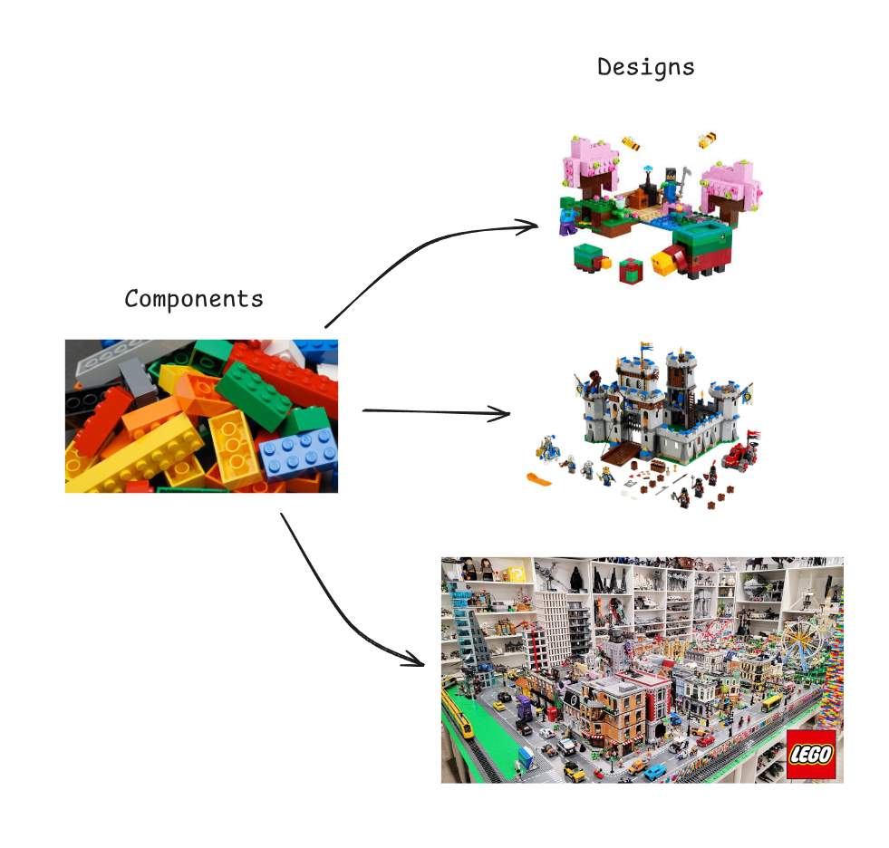
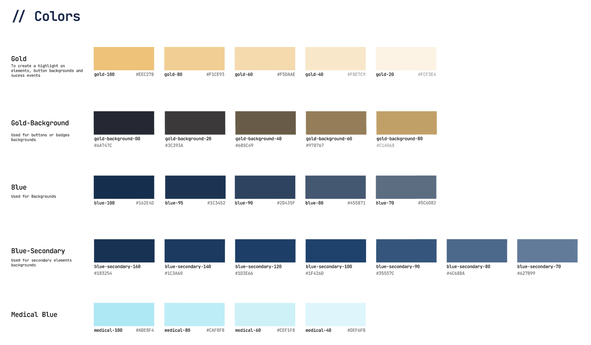
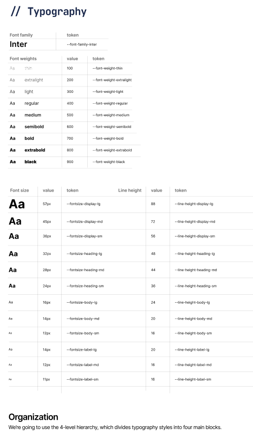
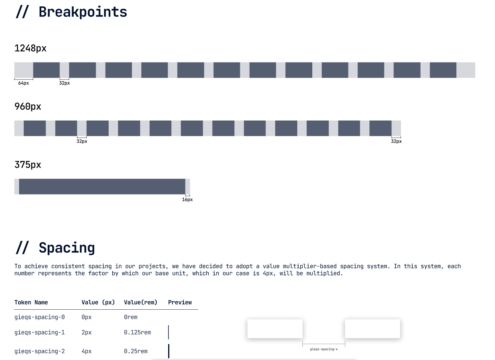
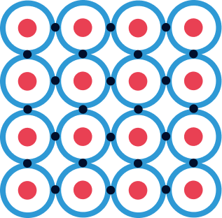
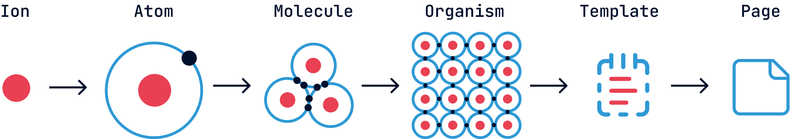

# Design Systems: Creating Visual Consistency Across Products

Imagine you're working as a designer for a company, responsible for designing multiple microservices. The first one turns out great, however, when it comes to creating the second one, you notice that there isn't much coherence with the first and that although they look similar, there's something that doesn't make them appear to be from the same company. Different fonts, spacing, styles, colors, and iconography are used...

Once the designs are completed, the client congratulates you, since they liked them, however, after some time they write to you, saying that while there has been an improvement compared to what they had before, the microservices weren't cohesive, there wasn't a correlation between them, and in short, they seemed like independent pieces rather than a company ecosystem.

<!-- more -->

It turns out that, faced with this feedback, you're overcome with frustration. After all the effort invested, there are still problems with visual coherence. Determined to solve this challenge once and for all, you begin to research and come across a revelation: a term you had never heard of before, **Design Systems**.

## What is a Design System?

When explaining what a Design System is, I like to make an analogy with _LEGO_. Just as these famous building blocks allow us to create unique and incredible structures, a Design System provides us with basic elements to build digital interfaces. These elements, called components, are like LEGO pieces: reusable (they can be used in multiple places) and modular (they function independently but integrate perfectly with others). And just as LEGO has themed series (Star Wars, Harry Potter, City) where all the pieces share a coherent aesthetic and combine perfectly with each other, a Design System ensures that all its elements "belong to the same family" visually.

Going more into technicalities and setting analogies aside, a **Design System** is a collection of reusable components, guided by clear principles, documented and standardized that allow teams to create designs in a coherent, consistent, and efficient manner. Additionally, it establishes a "common language" of design that greatly facilitates communication between design, development, and product teams.

Now that we understand what a Design System is and its importance for maintaining visual consistency, the practical question arises: how do we implement it? Creating a complete system from scratch might seem overwhelming, especially if we don't have a clear structure to guide the process. Fortunately, there are proven methodologies that offer a defined path. Among them stands out an approach that, inspired by scientific principles, allows us to build complex systems from simple elements.

## Atomic Design

The Atomic Design methodology, created by Brad Frost, is one of the most popular and effective ways to structure a Design System. This methodology takes inspiration from chemistry to organize interface components hierarchically, from the simplest to the most complex.

### Ions (Design Tokens)

Ions are the most fundamental and abstract elements of the system. Just as in chemistry ions are charged particles that form part of atoms, in design they represent the basic properties and variables that will define the entire system:

- Colors (primary, secondary, and neutral palettes)
- Typography (families, sizes, weights)
- Spacing (grid system, margins, paddings)
- Shadows and elevations
- Borders and radii
- Opacities
- Transitions and animations

#### Some examples

These elements, also known as "Design Tokens," have no functionality by themselves, but they are crucial as they define the visual identity of the system and affect all other components. They are the fundamental properties that, as variables, can be modified to alter the entire appearance of the system without changing its structure.

### Atoms

Atoms are the most basic and indivisible components of a Design System. Just as atoms in chemistry are the fundamental building blocks of matter, in design they represent the simplest elements of an interface:

- Buttons
- Text fields
- Icons
- Labels
- Checkboxes
- Simple selectors
- Avatars

These elements can be implemented independently and have a specific function, but they cannot be broken down further without losing that function. A button, for example, applies ionic properties (colors, typography, spacing), but constitutes an indivisible functional unit.

### Molecules

Molecules are formed when two or more atoms join together to create components with specific functionalities. Some examples would be:

- A search field (combines a text field, a button, and an icon)
- A selection group (radio buttons with their labels)
- A simple card (combines title, description, and possibly an image)

Molecules are relatively simple and focus on doing one thing well, but they already provide tangible functionality for the user.

### Organisms

Organisms are more complex components formed by combining molecules and/or atoms. They represent distinctive sections of an interface:

- A complete navigation bar (logo, menu, search, account buttons)
- A registration form (fields, validations, submission buttons)
- A product carousel (with product cards, navigation controls)
- A footer with multiple columns of information

Organisms are components complex enough to constitute complete sections of an interface.

### Templates

Templates are page layouts that show how organisms are organized in a coherent design. They don't contain real content but define the structure and layout:

- Home page template
- Product page template
- Contact form template
- Blog template

Templates act as high-fidelity wireframes, showing the distribution of elements in each type of page.

### Pages

Pages are specific instances of templates that show how the interface would look with real content:

- The current home page with seasonal promotions
- A specific product page with its images and descriptions
- A specific blog article with its content

Pages are the final manifestation of the entire system and allow testing how the Design System works in real scenarios.

### Why use Atomic Design?

- **Modularity**: Allows creating, testing, and maintaining components independently.
- **Scalability**: Facilitates the addition of new components without breaking existing ones.
- **Consistency**: Ensures that the same components are used throughout the interface.
- **Efficiency**: Reduces duplication of work by reusing components.
- **Collaboration**: Provides a common language for designers and developers.

If you want to delve deeper into this methodology, this book explains it perfectly and is one I based my understanding on (among others): [Atomic Design](https://atomicdesign.bradfrost.com/)

The Atomic Design methodology provides us with a structured framework to organize the components of our Design System, from the simplest elements to complete pages. This systematic approach not only facilitates the creation and maintenance of coherent interfaces, but also reflects many of the inherent advantages of implementing a Design System. However, like any solution, adopting a Design System entails both significant benefits and certain challenges that we must consider. Understanding these implications will help us evaluate whether this investment is appropriate for our specific context and how we can maximize its value while mitigating its potential drawbacks.

## Benefits and Drawbacks of Design Systems

Implementing a Design System is a strategic decision that can profoundly transform the way an organization approaches digital design. Like any strategy, it's important to sit down and analyze the pros and cons of each possible solution before making a decision.

### Benefits of implementing a Design System

#### **Consistency and visual coherence**

Perhaps the most evident benefit and the main reason we started this conversation: a Design System ensures that all of a company's digital products maintain a coherent appearance and behavior. Users perceive a unified experience regardless of the product or service they are using, thus strengthening brand identity.

#### **Development efficiency**

By having predefined and reusable components, development teams can implement new features or complete products in much less time. It's not necessary to "reinvent the wheel" every time a new interface is created, which significantly reduces delivery times.

#### **Improved collaboration between teams**

A Design System establishes a common vocabulary between designers, developers, and stakeholders. This "lingua franca" facilitates communication, reduces misunderstandings, and streamlines review and approval processes, creating a more harmonious workflow.

#### **Scalability**

As a company grows and diversifies its digital products, a well-implemented Design System grows with it. Adding new functionalities or adapting existing ones becomes easier when starting from a solid and structured foundation.

#### **Facilitates testing and quality control**

By using standardized components that have already been thoroughly tested, errors are reduced and the QA process is facilitated. Each component can be validated individually, ensuring it works correctly before integrating it into a broader context.

#### **Improves accessibility**

A good Design System incorporates accessibility considerations from its conception. This ensures that all products using it meet accessibility standards without requiring additional efforts from design or development teams.

#### **Reduces technical and design debt**

By establishing clear standards and maintaining updated documentation, the accumulation of "patches" or improvised solutions that often generate long-term problems is minimized.

### Drawbacks and challenges

#### **Significant initial investment**

Developing a complete Design System requires a considerable investment of time, resources, and effort. It's a medium to long-term project whose benefits are not always immediately visible, which can make it difficult to justify in environments where short-term results are prioritized.

#### **Resistance to change**

Implementing a Design System involves changes in established workflows. It's common to encounter resistance from teams accustomed to working with greater autonomy or with their own methodologies.

#### **Continuous maintenance**

A Design System is not a project that is completed and archived; it requires constant maintenance, updates, and evolution. Without a firm commitment to its maintenance, it can quickly become obsolete or, worse, become an obstacle rather than a tool.

#### **Can limit creativity**

Some designers may feel that working within the confines of a system limits their creative freedom. Finding the balance between standardization and flexibility is one of the greatest challenges in designing and managing these systems.

#### **Complexity in implementation**

For large organizations or those with extensive digital ecosystems, the transition to a Design System can be extremely complex, especially if it involves modifying existing products to adapt them to the new system.

#### **Requires organizational commitment**

The success of a Design System depends on the commitment of the entire organization, from management to operational teams. Without this cross-cutting support, the project is unlikely to reach its full potential.

#### **Learning curve**

New team members will need time to familiarize themselves with the Design System, its structure, components, and rules. This can initially slow down the incorporation of new talent.

After understanding the multiple benefits and challenges associated with Design Systems, a pragmatic question inevitably arises: when is it really advantageous to invest in their development? Not all business contexts or projects justify this investment of resources. Like any strategic tool, its implementation must respond to specific needs and align with organizational objectives. Let's analyze, therefore, the scenarios where a Design System can make a significant difference and those where perhaps more efficient alternatives exist.

### When does it make sense to implement a Design System?

A Design System is especially valuable in the following scenarios:

- When the company manages multiple digital products that need to maintain visual and functional coherence.
- In large or distributed teams where communication and coordination pose a challenge.
- In long-term projects where efficiency in development and maintenance is crucial.
- When looking to rapidly scale digital production capacity without compromising quality.

On the contrary, it might not be the best investment for:

- Startups in very early stages with limited resources and a single product.
- One-time or short-duration projects.
- Very small teams where communication and consistency are managed naturally.

The decision to implement a Design System should be based on a careful analysis of specific needs, available resources, and long-term organizational objectives. As we've seen, it's not a universal solution, but when implemented in the right context, it can radically transform the efficiency and quality of digital design.

Once we've evaluated the relevance of implementing a Design System and having decided to embark on this journey, the practical question inevitably arises: where do we start? So far, we've explored the conceptual foundations, from atomic structure to strategic considerations, but the path from theory to technical implementation requires a clear roadmap. Next, we'll outline the steps that will transform these concepts into tangible tools for our design and development teams.

## What's Next: From Concept to Implementation

The true value of a Design System materializes when it goes from being a concept to becoming a set of practical tools that teams use daily. This technical implementation process involves several fundamental steps that connect theory with practice.

### Definition and Documentation of Design Tokens

The first step consists of transforming our "ions" into concrete and documented design tokens. This involves:

- Coding each color, typography, and spacing value into usable variables
- Establishing clear and coherent naming conventions
- Documenting the purpose and proper use of each token
- Creating versioning systems to manage their evolution

### Development of the Component Library

With tokens defined, the next step is to develop a library of functional components that:

- Implements the atomic principles discussed earlier
- Translates visual designs into reusable code
- Incorporates tokens as variables that determine appearance
- Is accessible from different platforms and frameworks

This process may involve creating components in different technologies according to team needs (React, Vue, Angular, etc.) and requires close collaboration between designers and developers.

### Integration and Adoption Strategies

Technical implementation must be complemented with strategies that facilitate the system's adoption by all teams involved. This includes:

- Creating testing environments and component visualization (storybooks)
- Developing technical implementation guides
- Establishing workflows for contribution and maintenance
- Training and accompanying teams during the transition

In upcoming articles, we'll delve into each of these aspects, exploring specific tools, implementation methodologies, and practical cases that will illustrate the complete process of creating and integrating a Design System in different organizational contexts. From configuring token repositories to implementing components in code, through effective documentation strategies and change management, this journey is just beginning.

## References and Recommended Reading

This article has been nourished by the experience and knowledge shared by professionals and experts in the field. Below are some fundamental references for those who wish to delve deeper into the world of Design Systems:

### Books

- Frost, B. (2016). _Atomic Design_. [https://atomicdesign.bradfrost.com/](https://atomicdesign.bradfrost.com/) This book, available for free online, establishes the foundations of the Atomic Design methodology that we've extensively explored in this article.

### Articles and Web Resources

- Nielsen Norman Group. (2022). "Design Systems 101". [https://www.nngroup.com/articles/design-systems-101/](https://www.nngroup.com/articles/design-systems-101/) A concise but comprehensive introduction to the concept of Design Systems by one of the most respected groups in UX.

- Toman, J. (2023). "Beyond Atomic Design: Ions, Quarks and Design Tokens". [https://medium.com/designsystemsmastery/beyond-atomic-design-tokens-and-subatomic-particles](https://medium.com/designsystemsmastery/beyond-atomic-design-tokens-and-subatomic-particles) Exploration of extensions to the traditional Atomic model, including the concept of ions that we've integrated into our approach.

- Clark, J. (2021). "The Spectrum of Design Systems". [https://spectrum.adobe.com/page/design-systems/](https://spectrum.adobe.com/page/design-systems/) An analysis of different approaches and levels of maturity in Design Systems.

- Jonatan Hernandez. "LEGO, the best Design System mentor | Part 2 of 2". https://jonatanhernandez.substack.com/p/lego-el-mejor-mentor-de-design-system-69b Another perspective on ions.

### Reference Design Systems

- [Material Design](https://material.io/) (Google) One of the most complete and documented Design Systems, which has significantly influenced modern digital design.

- [Carbon Design System](https://www.carbondesignsystem.com/) (IBM) An excellent example of a Design System oriented to business products with integrated accessibility considerations.

- [Polaris](https://polaris.shopify.com/) (Shopify) Notable for its exhaustive documentation and approach centered on clear design principles.

- [Atlassian Design System](https://atlassian.design/) An example of a Design System that balances consistency with flexibility for diverse products.

### Tools and Platforms

- [Storybook](https://storybook.js.org/) Development environment for creating, documenting, and testing user interface components in isolation.

- [Figma](https://www.figma.com/) Collaborative design tool that facilitates the creation and maintenance of component libraries.
