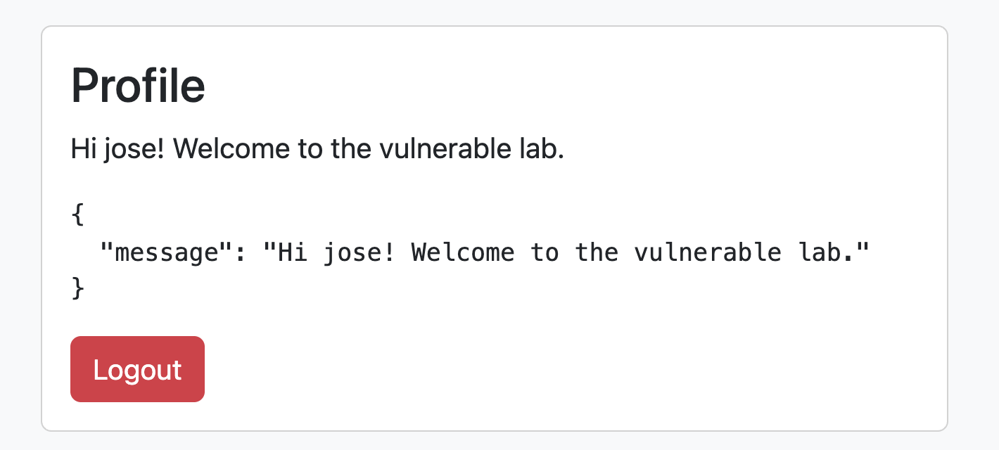
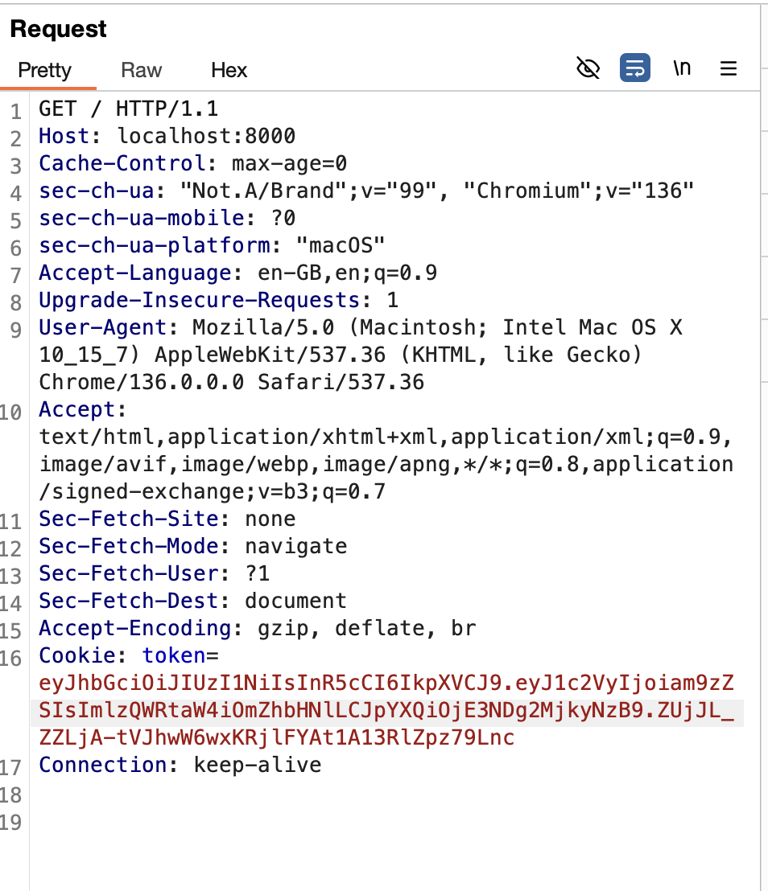
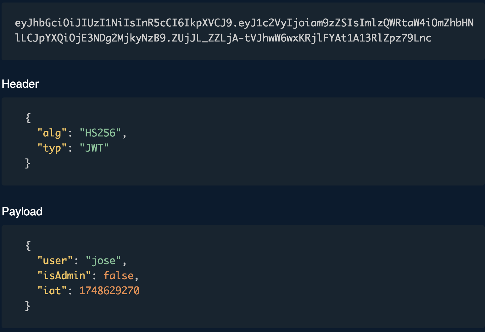
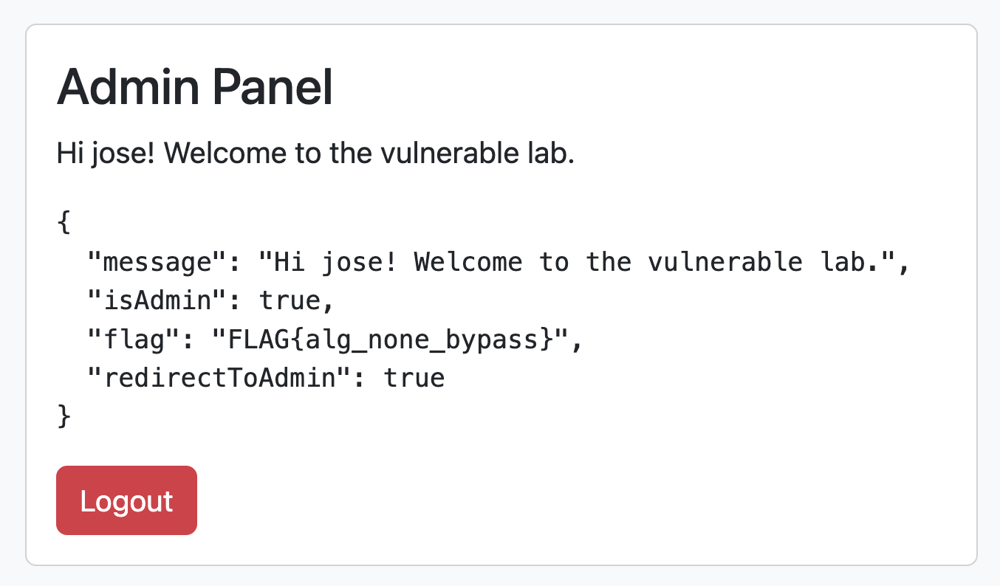

# Exploiting Common JWT Vulnerabilities: A Hands-On Lab Walkthrough

JSON Web Tokens (JWT) are widely used for authentication and authorization in modern web applications. However, misconfigurations and implementation flaws can introduce critical security vulnerabilities. This post explores a practical lab environment that demonstrates four common JWT vulnerabilities and provides step-by-step instructions for their exploitation.

<!-- Read More -->

## Lab Overview
The lab consists of a Node.js backend with endpoints for registration, login, profile, and admin access. The backend is intentionally vulnerable to the following attacks:

1. **alg:none Bypass**
2. **kid Injection**
3. **Algorithm Confusion**
4. **Payload Tampering**

You will obtain a flag for each vulnerability exploited, which is revealed upon successful exploitation.


## 1. alg:none Bypass (`FLAG{alg_none_bypass}`)
The backend accepts tokens with the `alg: "none"` header, allowing attackers to forge tokens without a valid signature.

### Exploitation Steps

1. **Obtain a valid JWT** by logging in as a regular user.
2. **Decode the token** and change the algorithm in the header to `"none"`.
3. **Remove the signature** (the third part of the JWT).
4. **Set the `isAdmin` claim to `true`** in the payload.
5. **Send the modified token** to the `/profile` or `/admin` endpoint.

### Proof of Concept

First, we log into the web application and use Burp Suite to inspect the request made when refreshing the page:

<figure markdown="span">
    
  <figcaption>Profile Panel</figcaption>
</figure>

Using Burp Suite, we analyze the data sent during the request:
<figure markdown="span">
    
  <figcaption>Burpsuite Interface Showing Session Token in Cookies</figcaption>
</figure>

We identify that the session token is passed via a cookie. We then use a [JWT editor](https://token.dev/){:target="_blank"} to decode and modify the token:

<figure markdown="span">
    
  <figcaption>Using a JWT Editor to Decode/Modify the Token</figcaption>
</figure>

To exploit the algorithm vulnerability, we modify the header from `"alg": "HS256"` to `"alg": "none"` and escalate privileges by setting `"isAdmin": true`:
```bash
{
"alg": "none",
"typ": "JWT",
"user": "jose",
"isAdmin": true,
"iat": 1748629270
}
```

We then copy the Base64-encoded modified token into Burp Suite and forward the request. This grants access to the `/admin` endpoint instead of `/profile`, demonstrating privilege escalation:

<figure markdown="span">
    
  <figcaption>Admin Access Achieved via Modified Token</figcaption>
</figure>

The backend grants admin access and returns the flag: `FLAG{alg_none_bypass}`


## 2. kid Injection (`FLAG{kid_injection}`)

### Description

The backend checks for a specific `kid` (Key ID) value in the JWT header, simulating a SQL injection vulnerability.

### Kid Injection (path traversal) Exploitation Steps

1. **Create a JWT with a malicious `kid` header**: 
```bash
{
"alg": "HS256",
"typ": "JWT",
"kid": "../../../../../../<file>"
}
```
2. **Sign the token** with the correct secret.
3. **Send the token** to the `/profile` endpoint.


### Proof of Concept


The backend detects the attack and returns the flag: `FLAG{kid_injection}`


<!-- ## 3. Algorithm Confusion (`FLAG{algorithm_confusion}`)

### Description

The backend allows forced algorithm verification via a query parameter, enabling confusion between signing algorithms (e.g., HS256 vs. RS256).

### Exploitation Steps

1. **Generate a key pair** (private/public) using OpenSSL.
2. **Create a JWT signed with RS256** and the private key.
3. **Send the token** to `/profile?forceConfusion=true`.
4. **If the backend uses HS256 but verifies with RSA**, the attack succeeds.

### Proof of Concept

The backend returns the flag: `FLAG{algorithm_confusion}`


## 4. Payload Tampering (`FLAG{payload_tampering}`)

### Description

The backend grants admin privileges if the `isAdmin` claim is `true`, regardless of the actual user.

### Exploitation Steps

1. **Log in as a regular user** and capture the JWT.
2. **Modify the payload** to set `isAdmin: true`.
3. **Re-sign the token** with the correct secret.
4. **Send the token** to the `/profile` endpoint.

### Proof of Concept

The backend grants admin access and returns the flag: `FLAG{payload_tampering}`
 -->


<!-- ## Bonus: Brute-Forcing the JWT Secret

If the JWT secret is weak (e.g., "secretKey123"), it can be brute-forced using tools like [jwt-cracker](https://github.com/lmammino/jwt-cracker): -->
