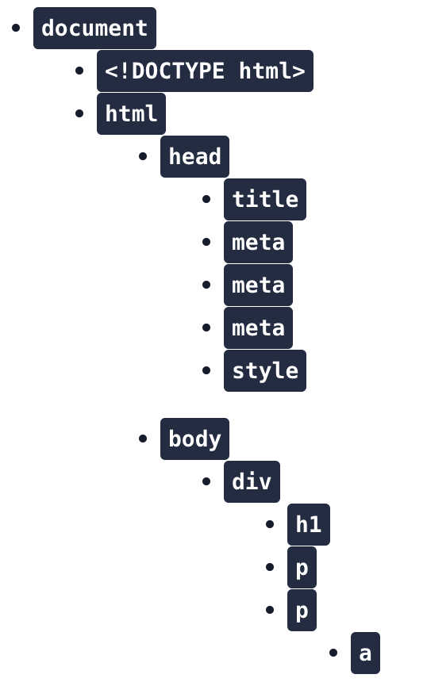
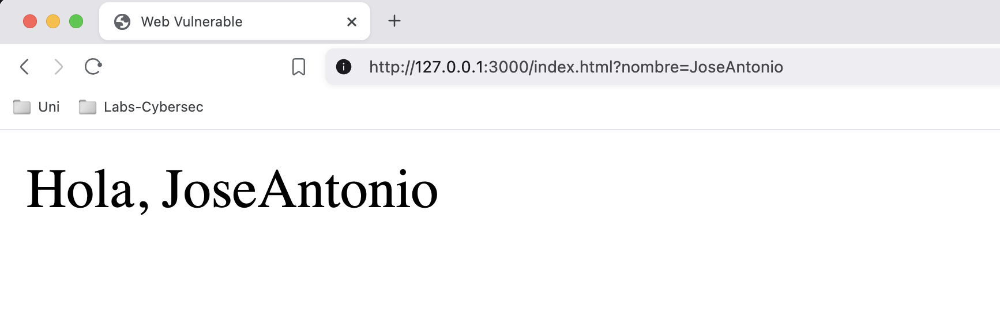
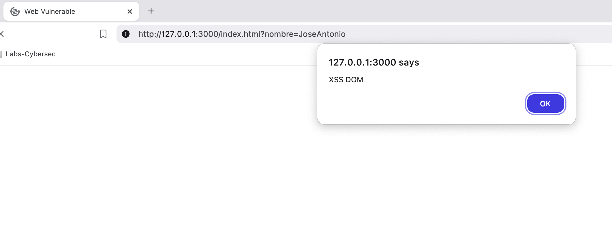
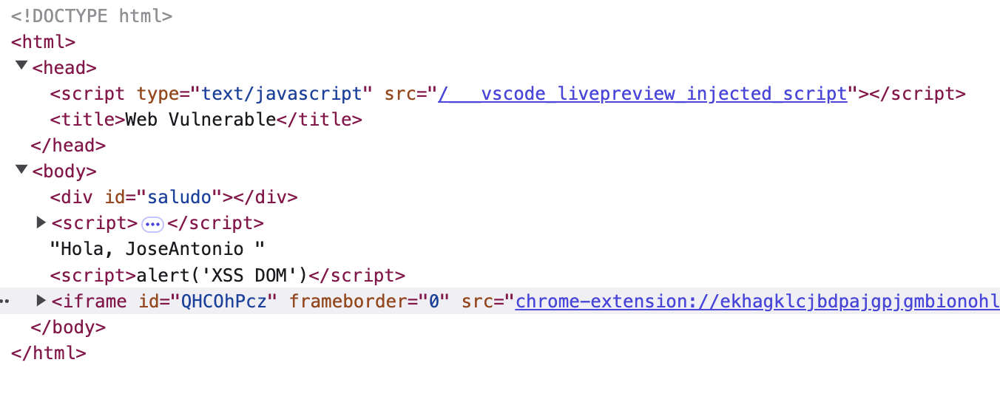

# Cross-Site Scripting: La Amenaza Invisible en tu Web

Las **vulnerabilidades de Cross-Site Scripting (XSS)** son un riesgo común y peligroso en la seguridad de aplicaciones web y con impactos nefastos en aplicaciones moviles y de escritorio. Permiten a atacantes inyectar código JavaScript malicioso en contextos de confianza. 

En el caso de aplicaciones web permite inyectar código JavaScript en sitios legítimos y utilizarlos para robar información de otros usuarios, manipular el comportamiento de la página o realizar acciones en la aplicación dentro del contexto de la sesión del usuario. En el caso de aplicaciones de escritorio, puede llevar directamente a ejecución de código arbitrario en el equipo de la victima.

Este artículo ofrece una visión detallada de los tres tipos principales de XSS: **Stored XSS**, **Reflected XSS** y **DOM-Based XSS**, explicando cómo ocurren, cómo se explotan y cómo prevenirlas.

<!-- more -->

## ¿Para qué se usa?

Los ataques Cross-Site Scripting (XSS) pueden ser utilizados principalmente para:

- **Robo de cookies de sesión:** Permite a los atacantes suplantar la identidad de usuarios legítimos y acceder a sus cuentas.
- **Suplantación de identidad:** Los atacantes pueden realizar acciones no autorizadas en nombre de la víctima, como cambiar contraseñas o realizar transacciones fraudulentas.
- **Phishing:** Pueden crear páginas o formularios falsos para engañar a los usuarios y robar sus credenciales.
- **Defacement:** Modificar la apariencia de sitios web para mostrar contenido malicioso o dañar la reputación de la organización.
- **Keylogging:** Registrar las pulsaciones del teclado para robar contraseñas y otra información sensible.
- **Ataques al navegador:** Explotar vulnerabilidades en el navegador de la víctima para ejecutar código malicioso.
- **Bypass de controles de acceso:** Eludir restricciones de seguridad como el envío de tokens CSRF.

## ¿Cómo explotarlas?

Los atacantes suelen seguir estos pasos para explotar vulnerabilidades XSS:

1. **Identificación de vulnerabilidades:** Buscan puntos de entrada donde puedan inyectar código JavaScript, como parámetros URL o campos de formularios.
2. **Creación del payload:** Desarrollan un script malicioso para realizar la acción deseada.
3. **Inyección del payload:** Insertan el código malicioso en la aplicación web, aprovechando la falta de sanitización.
4. **Entrega del ataque:** 
   - Para XSS reflejado: Engañan a la víctima para que acceda a un enlace malicioso o envíe un formulario manipulado.
   - Para XSS almacenado: El ataque se activa automáticamente cuando los usuarios acceden a la página comprometida.

## ¿Por qué ocurre?

Las vulnerabilidades XSS suelen ocurrir debido a:

- **Mala sanitización del código:** No se validan adecuadamente los datos proporcionados por los usuarios ni se escapan los caracteres HTML especiales.
- **Falta de codificación:** No se realiza una codificación correcta al insertar datos en diferentes contextos (HTML, JavaScript, URL).

Este tipo de vulnerabilidad no es inherente a un lenguaje de programación concreto, en nuestro caso nos vamos a centrar en PHP y JavaScript en los ejemplos para facilitar la comprensión.

## Stored XSS: La Bomba de Tiempo en tu Base de Datos

Las *Stored XSS*, o **XSS persistentes**, ocurren cuando una aplicación web almacena datos proporcionados por un atacante (que contienen código malicioso) en su base de datos. Este código se inserta en páginas web servidas a otros usuarios, afectando a todos los que visitan la página comprometida. Foros, reseñas de productos y secciones de comentarios son los blancos más comunes.

### Código PHP: vulnerable y solución

En este caso vemos que al realizar una petición **POST** (introducir datos), no se sanitiza la entrada de datos:

```php
<?php
//Guarda los comentarios de los usuarios
$comentario = $_POST['comentario'];
mysqli_query($conn, "INSERT INTO comentarios (comentario) VALUES ('$comentario')");
//Mostramos los comentarios
$resultado = mysqli_query($conn, "SELECT comentario FROM comentarios");
while($row = mysqli_fetch_assoc($resultado)){
  echo $row['comentario'];
}
?>
```

La variable `$comentario` almacena el input del usuario sin sanitizarla previamente, esto da una ventana al atacante para introducir cualquier payload.

Al mostrar los comentarios, el paylaod será interpretado en el contexto del navegador de la victima que visite la web.

Una posible mitigacion es la siguiente:
```php
<?php
//Guarda los comentarios de los usuarios codificados en UTF-8 y saneados
$comentario = mysqli_real_escape_string($conn, $_POST['comentario']);
mysqli_query($conn, "INSERT INTO comentarios (comentario) VALUES ('$comentario')");
//Mostramos los comentarios
$resultado = mysqli_query($conn, "SELECT comentario FROM comentarios");
while($row = mysqli_fetch_assoc($resultado)){
  //Mostramos los comentarios saneados y codificados en UTF-8
  echo htmlspecialchars($row['comentario'], ENT_QUOTES, 'UTF-8');
}
?>
```

Se ha saneado el input de datos con la función `mysqli_real_escape_string` de *PHP*, y la salida de los comentarios mediante `htmlspecialchars`.

- `mysqli_real_escape_string`: Escapa todos los caracteres especiales que puede contener el input del usuario.

- `htmlspecialchars`: Asegura que todos los caracteres especiales se convierten a sus correspondientes entidades HTML.

### Código JavaScript vulnerable y solución

Existen múltiples frameworks para implementar un backend haciendo uso de JavaScript, pero la sintaxis es similar en todos ellos. El siguiente ejemplo en Node.js vale para ilustrar la misma vulnerabilidad
```javascript
app.get('/comments', (req, res) => {
  let html = '<ul>';
  for(const comentario of comments){
    html += `<li>${comentario}</li>`;
  }
  html += '</ul>';
  res.send(html);
});
```

Este código lista los comentarios en la sección "*comments*" de la aplicación, pero no escapa los caracteres especiales en la variable `${comentario}`, permitiendo inyectar HTML y ejecutar código JavaScript arbitrario.

Este código se puede mejorar saneando los caracteres especiales mediante funciones como sanitizeHtml():

```javascript
const sanitizeHtml = require('sanitize-html');
app.get('/comments', (req, res) => {
  let html = '<ul>';
  for(const comentario of comments){
    const ComentarioSaneado = sanitizeHtml(comentario);
    html += `<li>${ComentarioSaneado}</li>`;
  }
  html += '</ul>';
  res.send(html);
});
```

## Reflected XSS: El Ataque Oportunista

Una vez visto las *Stored XSS*, las **Reflected XSS** ocurren solo en el lado del cliente. Estas vulnerabilidades a menudo se dan por la **manipulación de URLs** o de **formularios** , en estos casos el atacante debe valerse de metodos de ingeniera social o de cadenas de vulnerabilidades para conseguir inyectar el payload en el contexto de la victima.

### Código PHP vulnerable y solución

En este caso esta vulnerabilidad existe por no sanitizar el parametro query previamente a introducirlo en el HTML a renderizar 
```php
<?php
$search_query = $_GET['query'];
echo "<p>Has buscado: $search_query</p>";
?>
```

Si tenemos la siguiente URL `http://url/search?query=resultado_busqueda`, y sustituimos `resultado_busqueda` por `<script>alert("Hola");</script>`, el script inyectado será reflejado en la página, ya que no se están saneando las entidades HTML. La solución podría pasar de nuevo por el uso de `htmlspecialchars`.

### Código JavaScript vulnerable y solución

Al igual que para las *Stored XSS*, usaremos un ejemplo de aplicación web implementada con el framework **Node.js**.

Esta aplicación tiene el siguiente fragmento de código:

```javascript
const express = require('express');
const app = express();

app.get('/search', function(req, res){
  var searchTerm = req.query.query;
  res.send('Has buscado: ' + searchTerm);
});

app.listen(80);
```

En la línea 5, vemos que se obtiene el contenido de la variable `query` que aparece en la URL `http://url/search?query=resultado_busqueda`. Esta entrada de datos no tiene ningún saneamiento llevando a una vulnerabilidad de *Reflected XSS*. Igual que para el caso del Stored XSS podemos solucionarlo con librerias como sanitize-html o DomPurify.

## DOM-Based XSS: El Peligro Invisible en el Cliente

El **DOM-Based XSS** es una vulnerabilidad de seguridad web que ocurre en el lado del cliente, sin necesidad de interacción con el servidor. Esta vulnerabilidad puede manifestarse de manera diferente según el navegador utilizado.

### ¿Qué es el DOM?

El **DOM (Document Object Model)** es una interfaz de programación que representa un documento web como una estructura de árbol. Permite manipular dinámicamente las diferentes partes de un sitio web utilizando JavaScript.

La estructura del **DOM** se compone de:
- Elementos HTML (nodos)
- Atributos de elementos
- Texto dentro de los elementos
- Comentarios

<figure markdown="span">
  
    <figcaption>Estructura del DOM</figcaption>
</figure>

### Metodología

El atacante intenta inyectar un script malicioso, típicamente a través de la URL, que se ejecutará en el navegador del cliente sin intervención del servidor. El proceso general es el siguiente:

1. El atacante identifica una vulnerabilidad en el manejo del DOM por parte de la aplicación web.
2. Crea una URL maliciosa que contiene código JavaScript como parte de un parámetro o fragmento de la URL.
3. Engaña a la víctima para que acceda a esta URL maliciosa.
4. El navegador de la víctima carga la página y ejecuta el código JavaScript legítimo de la aplicación.
5. Este código legítimo utiliza datos de la URL (que contiene el payload malicioso) para modificar el DOM.
6. Como resultado, el script malicioso se ejecuta en el contexto de la página web, permitiendo al atacante realizar acciones como robo de cookies, manipulación de contenido o redirección a sitios maliciosos.

### Códigos vulnerables y soluciones

Tenemos la siguiente página web:
```html
<!DOCTYPE html>
<html>
<head>
<title>Web Vulnerable</title>
</head>
<body>
  <div id="saludo"></div> 
  <script>
  const nombre = new URLSearchParams(window.location.search).get('nombre');
  document.write("Hola, " + nombre); 
  </script>
</body> 
</html>
```
Como podemos ver en la línea de código 10, la página web hace uso de la función `document.write()`, la cual inserta un parámetro `nombre` sin ser previamente saneado. Por tanto, hemos identificado una vulnerabilidad DOM-Based XSS, donde el atacante puede modificar la URL añadiendo un script malicioso en `?nombre`, que se ejecutará en el navegador del cliente.

<figure markdown="span">
  
    <figcaption>URL de la Web</figcaption>
</figure>

Ahora, si insertamos en el código HTML una alerta de JavaScript vamos a ver que se ejecuta cada vez que accedamos a la web:
```html
<!DOCTYPE html>
<html>
<head>
  <title>Web Vulnerable</title>
</head>
<body>
  <div id="saludo"></div>

  <script>
    const nombre = new URLSearchParams(window.location.search).get('nombre');
    document.write("Hola, " + nombre);
    </script>
    <script>alert('XSS DOM')</script>
</body>
</html>
```
<figure markdown="span">
  
    <figcaption>Web vulnerable a DOM-Based XSS</figcaption>
</figure>

Como vemos, el script se ejecutó y mostró la alerta, además vamos a ver que el `body` obtuvo un nuevo elemento `script`:

<figure markdown="span">
  
    <figcaption>Modificación del DOM</figcaption>
</figure>

Este ejemplo básico muestra un par de cosas:

1. El servidor no tiene un rol directo en este tipo de vulnerabilidades.

2. El DOM se modificó de forma insegura utilizando `document.write()`.

Para solucionar esta vulnerabilidad, podemos modificar el código de la siguiente manera:

```html
<!DOCTYPE html>
<html>
<head>
  <title>Web Segura</title>
</head>
<body>
  <div id="saludo"></div>
  <script>
  const nombre = new URLSearchParams(window.location.search).get('nombre');
  const nombre_escapado = encodeURIComponent(nombre);
  document.getElementById("saludo").textContent = "Hola, " + nombre_escapado;
  </script>
</body>
</html>
```
Como vemos en la línea 10, hacemos uso del método `encodeURIComponent` el cual realiza un saneo de los caracteres especiales que pueda tener el parámetro de la consulta, además insertamos dicho contenido mediante `textContent`.

## Resumen y Conclusiones
Las vulnerabilidades de Cross-Site Scripting (XSS) representan una amenaza persistente para la seguridad de las aplicaciones web. Comprender los tres tipos principales – Stored XSS, Reflected XSS y DOM-Based XSS – es crucial para desarrollar estrategias de defensa efectivas.

La **sanitización de entradas**, la **codificación de salidas** y **la validación en múltiples capas** son las mejores prácticas para mitigar el riesgo de XSS. Además, el uso de Content Security Policy (CSP) puede ofrecer una capa adicional de protección al controlar los recursos que el navegador puede cargar. Es fundamental que los desarrolladores se mantengan actualizados sobre las últimas técnicas de ataque y defensa para proteger sus aplicaciones contra estas vulnerabilidades. La formación continua y las auditorías de seguridad periódicas son esenciales para garantizar un entorno web más seguro.

---
