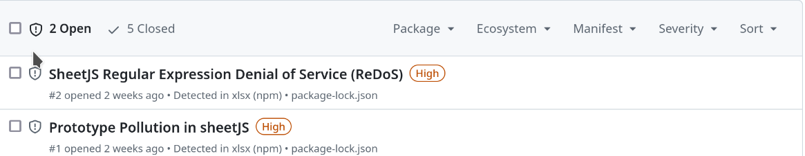
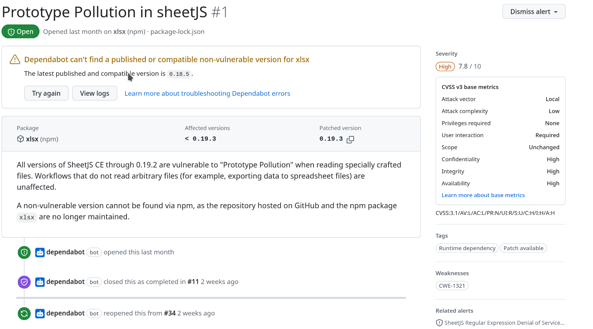

# El día que Dependabot conoció a SheetJS

Todo comenzó hace unos días con una notificación de Dependabot. Mientras revisaba un repositorio de un proyecto interno, me encontré con el siguiente mensaje:

<figure markdown="span">
  
  <figcaption>Alerta de Dependabot</figcaption>
</figure>

Procedí con el **workflow estándar de Dependabot para abordar los problemas**, asumiendo que se trataba de una actualización rutinaria. Sin embargo, me sorprendió cuando las correcciones para ambas vulnerabilidades fallaron porque **no se pudo encontrar la versión parcheada requerida.**

<!-- more -->

<figure markdown="span">
  
  <figcaption>Alerta de Dependabot por DoS en SheetJS</figcaption>
</figure>
<figure markdown="span">
  
  <figcaption>Alerta de Dependabot por Prototype Pollution en SheetJS</figcaption>
</figure>

Después de algunas investigaciones, descubrí un conflicto entre npm y los desarrolladores de xlsx, debido a un problema con el token de la Autenticación Multi Factor (MFA) de hace unos años. Como resultado, **xlsx ha abandonado el ecosistema npm** y ahora publica sus paquetes a través de otra Redes de Distribución de Contenidos (CDN) para la distribución de sus paquetes. Esto ha introducido un nuevo nivel de **complejidad**, haciendo más difícil para los usuarios de npm actualizar los paquetes y **resolver vulnerabilidades** de forma efectiva.

Dado que nuestra aplicación se vio afectada por estas vulnerabilidades, decidí profundizar en ellas para **evaluar el riesgo** de retrasar el parche y explorar posibles soluciones si fuera necesario, y también fue una buena excusa para escribir un artículo para el blog, un artículo que seguro puede ayudar a más de un desarrollador a decidir cómo afrontar la misma situación en SheetJS o xlsx. Con esto en mente, analicemos las dos vulnerabilidades reportadas por el dependabot con más detalle:

## Prototype Pollution en SheetJS aka CVE-2023-30533

Esta vulnerabilidad en SheetJs permite a un atacante subir creado especialmente para **corromper los prototipos existentes de los objetos** en la aplicación. Prototype Pollution podría conducir potencialmente a problemas serios como **Ejecución Remota de Comandos** (RCE), **Cross-Site Scripting** (XSS) o **Denegaciones de Servicios** (DoS). Dependiendo del contexto, se trata de una amenaza importante.

Indagando, encontré un artículo escrito por un investigador de Solid Labs que descubrió la vulnerabilidad. Aunque este artículo está en ruso y parcialmente detrás de un paywall, da alguna idea del contexto y el impacto de la vulnerabilidad. Por un lado el riesgo parece ser limitado, por el otro confirma que **XSS se puede lograr** con esta vulnerabilidad, aunque la prueba de concepto para el XSS está detrás del paywall.

Utilizando la parte gratuita disponible del artículo, pude crear un PoC básico para prototype pollution con un impacto limitado. Esto nos permite probar si nuestra aplicación era vulnerable e implementar un parche específico para **sanear el vector de ataque** mientras que preparamos una actualización completa. También utilizamos el PoC y revisando el commit que parcheaba esta vulnerabilidad, encontré que la vulnerabilidad ocurría al importar una hoja con comentarios. La causa parece ser que **los desarrolladores no previeron que las referencias a celdas podían ser manipuladas** por un atacante. Su solución final fue validar que la referencia a las celdas fuera legítimas.

Sabiendo esto, podemos crear un parche local para la versión de nuestra biblioteca, pero habiendo trabajado como pentester varios años, tenía curiosidad de cómo escalaba de prototype pollution a XSS. **Revisar el parche** fue clave para encontrar el vector XXS:

<figure markdown="span">
  
  <figcaption>Commit que soluciona el XSS</figcaption>
</figure>

Podemos ver que los desarrolladores añadieron **escapehtml** a una línea en el mismo commit que corrige la vulnerabilidad. Rastreando el código hacia atrás, podemos ver que la línea corregida sólo se ejecutaba cuando la biblioteca se usaba para parsear el XLS a HTML utilizando la función make_html_row. En nuestro caso, como no utilizamos parsing HTML en nuestra aplicación, esta vulnerabilidad no es crítica, ya que no utilizamos la función vulnerable. Sin embargo, hemos aplicado los dos parches localmente para **mejorar la seguridad** mientras que preparamos el actualización completa.

Sabiendo esto, desarrolla un exploit para generar XLSX malicioso con un **payload XSS es bastante sencillo**. Sin embargo, para no facilitar la explotación publicando un PoC para una vulnerabilidad difícil de mitigar, no publicaré un PoC funcional para explotar este XSS en un paquete que recibe 2,5 millones de descargas semanalmente.

## SheetJS Denegación de Servicio por Expresiones Regulares (ReDoS) (CVE-2024-22363)

Esta vulnerabilidad permite a un atacante subir una archivo que cause un **retraso significativo** en una aplicación explotando **defectos en expresiones regulares** en SheetJS. Aunque no es crítica para nuestra aplicación, me interesa replicar el problema y crear un parche virtual temporal hasta que la actualización esté lista.

El primer paso fue examinar el commit en el repositorio SheetJS. El código mostraba varios **patrones codiciosos regex**, en particular el reportado se encuentra en el comentario <!--). The researcher provided a PoC demonstrating how to exploit this vulnerability.

Podemos verificar la vulnerabilidad de la siguiente manera:

<figure markdown="span">
    
  <figcaption>Prueba de Concepto para ReDoS</figcaption>
</figure>

Mientras que el PoC muestra un retardo de 42 segundos, la **carga de trabajo crece exponencialmente** con archivos más grandes. Un archivo con un tamaño diez veces más grandes que el original tardaría 4.980 segundos en procesarse, es decir, 100 veces más de retardo para un contenido diez veces mayor.

En nuestro caso, las pruebas del PoC en nuestro entorno de desarrollo no mostraron ningún retardo perceptible, ya que nuestra aplicación **valida que el archivo sea una archivo XLS real** antes de parsearlo. Esta validación mitiga la explotabilidad de la vulnerabilidad en nuestra configuración. Sin embargo, sigue siendo necesario abordar el problema, ya que hay más expresiones regulares codiciosas en la biblioteca.

Se identificaron dos posibles soluciones:

* Detectar señales de explotación antes de parsear el XLS.
* Actualizar la versión de SheetJS.

La primera opción tiene inconvenientes. La comprobación de patrones de explotación mediante regex puede introducir inadvertidamente nuevas vulnerabilidades ReDos, y abordar todos los patrones regex problemáticos añade una complejidad innecesaria.

La segunda opción, aunque sencilla, se complica por el hecho de que el paquete ya no pertenece al ecosistema npm y debe de ser importado manualmente.

Dadas estas consideraciones, nuestro equipo en Atlansec eligió la segunda opción y **actualizó SheetJS** para esta aplicación.

## Conclusión

La alerta de Dependabot sobre vulnerabilidades en SheetJS sirvió como recordatorio de la **complejidad de la gestión de dependencias**. Abordar estos problemas requiere más que una simple actualización con un clic. Para tomar una buena decisión, nos sumergimos a fondo en las vulnerabilidades, **analizando su impacto** en nuestra aplicación y la viabilidad de las soluciones disponibles.

Examinando de cerca las vulnerabilidades, Atlansec ha desarrollado **estrategias de mitigación in situ** que satisfacen las necesidades de nuestra aplicación. Como en la mayoría de proyectos, no se trata sólo de corregir las alertas, sino de comprender sus implicaciones y tomar decisiones que **equilibren las necesidades de seguridad y operativas**. Para nosotros, fue un recordatorio de cómo la vigilancia y la adaptabilidad pueden convertir los retos de dependencia en oportunidades para **reforzar la postura de seguridad de nuestras aplicaciones**. Y lo importante que es crear una postura de seguridad tanto en el desarrollo como en el mantenimiento de la aplicación, no solo desde la perspectiva de una prueba de vulnerabilidad ocasional.

Stay safe. Stay smart. Stay secure.

---