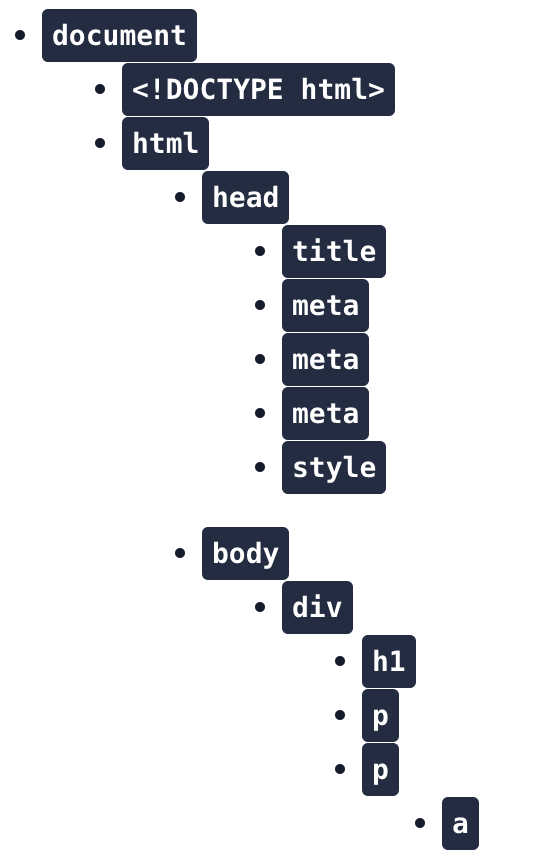
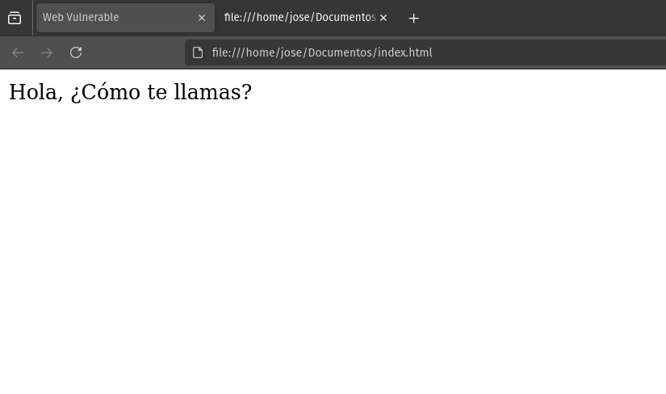
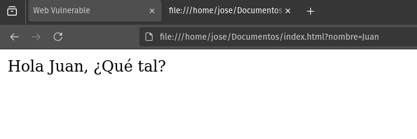
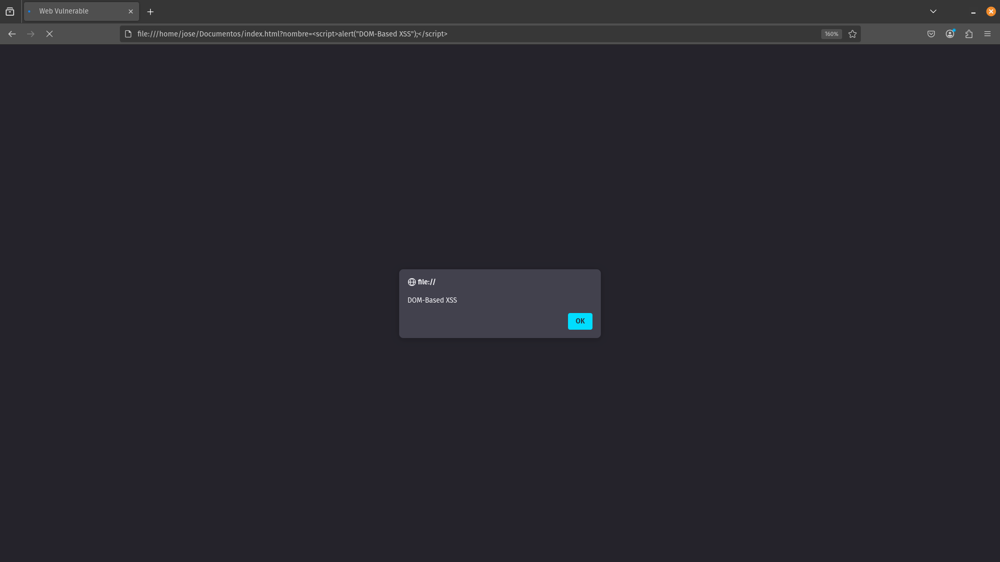
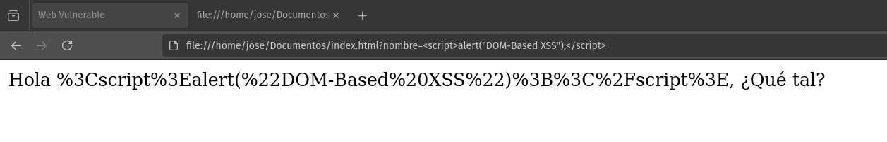

# Cross-Site Scripting: La Amenaza Invisible en tu Web

Las **vulnerabilidades de Cross-Site Scripting (XSS)** son un riesgo común y peligroso en la seguridad de aplicaciones web y con impactos nefastos en aplicaciones móviles y de escritorio. Permiten a atacantes inyectar código JavaScript malicioso en contextos de confianza. 

En el caso de aplicaciones web permite inyectar código JavaScript en sitios legítimos y utilizarlos para robar información de otros usuarios, manipular el comportamiento de la página o realizar acciones en la aplicación dentro del contexto de la sesión del usuario. En el caso de aplicaciones de escritorio, puede llevar directamente a ejecución de código arbitrario en el equipo de la victima.

Este artículo ofrece una visión detallada de los tres tipos principales de XSS: **Stored XSS**, **Reflected XSS** y **DOM-Based XSS**, explicando cómo ocurren, cómo se explotan y cómo prevenirlas.

<!-- more -->

## ¿Para qué se usa?

Los ataques Cross-Site Scripting (XSS) pueden ser utilizados principalmente para:

- **Robo de cookies de sesión:** Permite a los atacantes suplantar la identidad de usuarios legítimos y acceder a sus cuentas.
- **Suplantación de identidad:** Los atacantes pueden realizar acciones no autorizadas en nombre de la víctima, como cambiar contraseñas o realizar transacciones fraudulentas.
- **Phishing:** Pueden crear páginas o formularios falsos para engañar a los usuarios y robar sus credenciales.
- **Defacement:** Modificar la apariencia de sitios web para mostrar contenido malicioso o dañar la reputación de la organización.
- **Keylogging:** Registrar las pulsaciones del teclado para robar contraseñas y otra información sensible.
- **Ataques al navegador:** Explotar vulnerabilidades en el navegador de la víctima para ejecutar código malicioso.
- **Bypass de controles de acceso:** Eludir restricciones de seguridad como el envío de tokens CSRF (Cross-Site Request Forgery).

## ¿Cómo explotarlas?

Los atacantes suelen seguir estos pasos para explotar vulnerabilidades XSS:

1. **Identificación de vulnerabilidades:** Buscan puntos de entrada donde puedan inyectar código JavaScript, como parámetros URL o campos de formularios.
2. **Creación del payload:** Desarrollan un script malicioso para realizar la acción deseada.
3. **Inyección del payload:** Insertan el código malicioso en la aplicación web, aprovechando la falta de sanitización.
4. **Entrega del ataque:** 
   - Para XSS reflejado: Engañan a la víctima para que acceda a un enlace malicioso o envíe un formulario manipulado.
   - Para XSS almacenado: El ataque se activa automáticamente cuando los usuarios acceden a la página comprometida.

## ¿Por qué ocurre?

Las vulnerabilidades XSS suelen ocurrir debido a:

- **Mala sanitización del código:** No se validan adecuadamente los datos proporcionados por los usuarios ni se escapan los caracteres HTML especiales.
- **Falta de codificación:** No se realiza una codificación correcta al insertar datos en diferentes contextos (HTML, JavaScript, URL).

Este tipo de vulnerabilidad no es inherente a un lenguaje de programación concreto, en nuestro caso nos vamos a centrar en PHP y JavaScript en los ejemplos para facilitar la comprensión.

## Stored XSS: La Bomba de Tiempo en tu Base de Datos

Las *Stored XSS*, o **XSS persistentes**, ocurren cuando una aplicación web almacena datos proporcionados por un atacante (que contienen código malicioso) en su base de datos. Este código se inserta en páginas web servidas a otros usuarios, afectando a todos los que visitan la página comprometida. Foros, reseñas de productos y secciones de comentarios son los blancos más comunes.

### Código PHP: vulnerable y solución

En el siguiente ejemplo vemos dos vulnerabilidades, una inyeccion SQL y un punto de entrada para XSS. Para este post nos centraremos en la segunda, donde vemos que al realizar una petición **POST** (introducir datos), no se sanitiza la entrada de datos:

```php
<?php
//Guarda los comentarios de los usuarios
$comentario = $_POST['comentario'];
mysqli_query($conn,"INSERT INTO comentarios (comentario) VALUES ('$comentario')");
//Mostramos los comentarios
$resultado = mysqli_query($conn, "SELECT comentario FROM comentarios");
while($row = mysqli_fetch_assoc($resultado)){
  echo $row['comentario'];
}
?>
```

La variable `$comentario` almacena el input del usuario sin sanitizarla previamente, esto da una ventana al atacante para introducir cualquier payload.

Al mostrar los comentarios, el payload será interpretado en el contexto del navegador de la victima que visite la web.

Una posible mitigación es la siguiente:
```php
<?php
// Conexión a la base de datos (ajusta las credenciales)
$conn = new mysqli("localhost", "usuario", "contraseña", "basedatos");

// Verifica la conexión
if ($conn->connect_error) {
    die("Error de conexión: " . $conn->connect_error);
}

// Verifica si se ha enviado un comentario
if ($_SERVER["REQUEST_METHOD"] === "POST" && isset($_POST['comentario'])) {
    // Eliminamos espacios en blanco al inicio y al final
    $comentario = trim($_POST['comentario']); 

    // Evitar SQL Injection con prepared statements
    $stmt = $conn->prepare("INSERT INTO comentarios (comentario) VALUES (?)");
    $stmt->bind_param("s", $comentario);
    $stmt->execute();
    $stmt->close();
}

// Mostramos los comentarios de forma segura
$resultado = $conn->query("SELECT comentario FROM comentarios");
while ($row = $resultado->fetch_assoc()) {
    echo htmlspecialchars($row['comentario'], ENT_QUOTES, 'UTF-8') . "<br>";
}

// Cerramos la conexión
$conn->close();
?>
```

Aunque no es el kit de este post, se ha protegido la inserción de datos utilizando **Prepared Statements** en *PHP*, y la salida de los comentarios mediante `htmlspecialchars`.

- **Prepared Statements**: Evitan **SQL Injection** al separar los datos de la consulta SQL, asegurando que el input del usuario se trate como un valor y no como parte del código SQL.
- `htmlspecialchars`: Asegura que todos los caracteres especiales se convierten a sus correspondientes entidades HTML, evitando ataques **XSS**.
!!! Danger
    No hacemos uso de `mysqli_real_escape_string` debido a que **NO** protege contra SQL Injection por sí solo, ya que depende de la configuración de `set_charset()`. Si consultamos la [documentación oficial](https://www.php.net/manual/es/mysqli.real-escape-string.php){:target="_blank"} veremos que nos advierte de que si la codificación no se establece correctamente, el escape de caracteres especiales puede no funcionar como se espera, permitiendo ataques de inyección en algunas configuraciones.

### Código JavaScript: Vulnerabilidad y solución

Existen múltiples frameworks para implementar un backend con JavaScript, pero la sintaxis es similar en todos ellos.  
El siguiente ejemplo en **Node.js** ilustra una vulnerabilidad de **Cross-Site Scripting (XSS)** en la generación de contenido dinámico:

```javascript
app.get('/comments', (req, res) => {
  let html = '<ul>';
  for (const comentario of comments) {
    html += `<li>${comentario}</li>`;
  }
  html += '</ul>';
  res.send(html);
});
```

Este código lista los comentarios en la sección "*comments*" de la aplicación, **pero no escapa los caracteres especiales en la variable** `${comentario}`, permitiendo inyectar HTML y ejecutar código JavaScript arbitrario.

Para prevenir **ataques XSS**, se deben sanear los caracteres especiales antes de renderizar el contenido en el frontend. Por tanto, este código se puede mejorar saneando los caracteres especiales mediante funciones como `sanitizeHtml()`:

```javascript
const sanitizeHtml = require('sanitize-html');
app.get('/comments', (req, res) => {
  let html = '<ul>';
  for(const comentario of comments){
    const ComentarioSaneado = sanitizeHtml(comentario);
    html += `<li>${ComentarioSaneado}</li>`;
  }
  html += '</ul>';
  res.send(html);
});
```
!!! Warning
    Podemos utilizar diversas bibliotecas como `DOMPurify`, `sanitize-html` o `isomorphic-dompurify` para parchear vulnerabilidades **XSS**, dependiendo de si estamos trabajando en el frontend o backend.

- `DOMPurify`: Purifica el **HTML en aplicaciones frontend**, eliminando código malicioso.
- `sanitize-html`: Ideal para el backend, sanitiza el **HTML eliminando etiquetas** y **atributos peligrosos**.
- `isomorphic-dompurify`: Versión de **DOMPurify** que funciona tanto en el **frontend** como en el **backend**.

En el ejemplo anterior, utilizamos `sanitize-html` porque estamos trabajando en un entorno **Node.js**.

## Reflected XSS: El Ataque Oportunista

Al contrario que en el caso de las *Stored XSS*, las **Reflected XSS** ocurren solo en el lado del cliente. Estas vulnerabilidades a menudo surgen en la **manipulación de URLs** o de **formularios** , en estos casos el atacante debe valerse de métodos de ingeniera social o de cadenas de vulnerabilidades para conseguir hacer llegar el payload al contexto de la victima.

### Código PHP vulnerable y solución

En este caso esta vulnerabilidad existe por no sanitizar el parámetro query previamente a introducirlo en el HTML a renderizar:
```php
<?php
$search_query = $_GET['query'];
echo "<p>Has buscado: $search_query</p>";
?>
```

Si tenemos la siguiente URL `http://url/search?query=resultado_busqueda`, y sustituimos `resultado_busqueda` por `<script>alert("Hola");</script>`, el script inyectado será reflejado en la página, ya que no se están saneando las entidades HTML. La solución podría pasar de nuevo por el uso de `htmlspecialchars`.

### Código JavaScript vulnerable y solución

Al igual que para las *Stored XSS*, usaremos un ejemplo de aplicación web implementada con el framework **Node.js**.

Esta aplicación tiene el siguiente fragmento de código:

```javascript
const express = require('express');
const app = express();

app.get('/search', function(req, res){
  var searchTerm = req.query.query;
  res.send('Has buscado: ' + searchTerm);
});

app.listen(80);
```

Vemos que se obtiene el contenido de la variable `query` que aparece en la URL `http://url/search?query=resultado_busqueda`. Esta entrada de datos no tiene ningún saneamiento llevando a una vulnerabilidad de *Reflected XSS*. Igual que para el caso del Stored XSS podemos solucionarlo con librerias como `sanitize-html` o `DomPurify`.

## DOM-Based XSS: El Peligro Invisible en el Cliente

El **DOM-Based XSS** es una vulnerabilidad de seguridad web que se produce en el lado del cliente, la diferencia con los reflected es xss es que estas se ejecutan *sin necesidad de que el servidor refleje el payload del ataque directamente en la respuesta*. Esto se consigue manipulando el Document Object Model (DOM) en el navegador del usuario mediante diversas técnicas.

### ¿Qué es el DOM?

El **DOM (Document Object Model)** es una interfaz de programación que representa un documento web como una estructura de árbol. Los sitios web pueden hacer uso de JavaScript para acceder y modificar dinámicamente el contenido, la estructura y el estilo de un documento web.

La estructura del **DOM** se compone de:

- Elementos HTML (nodos)
- Atributos de elementos
- Texto dentro de los elementos
- Comentarios

<figure markdown="span" style="width:30%;">
  
  <figcaption>Estructura del DOM</figcaption>
</figure>

### Metodología del Ataque DOM-Based XSS

El atacante inyecta un script malicioso que se ejecuta en el navegador del cliente manipulando el DOM. El proceso general es:

1.  **Identificación de la Vulnerabilidad:** El atacante encuentra un punto en el código JavaScript del lado del cliente donde los datos controlados por el atacante (por ejemplo, parámetros de la URL) se utilizan para modificar el DOM de manera insegura. Esto implica identificar tanto la **fuente** de los datos (donde entran los datos controlados por el atacante) como el **sink** (donde los datos se usan de forma peligrosa para manipular el DOM).
2.  **Creación de la URL Maliciosa:** Se crea una URL que contiene código JavaScript malicioso, típicamente como parte de un parámetro o fragmento de la URL. *El payload se coloca en una fuente de datos controlable por el atacante*.
3.  **Engaño a la Víctima:** La víctima es engañada para que acceda a la URL maliciosa a través de phishing, enlaces acortados, etc.
4.  **Ejecución en el Navegador:** El navegador de la víctima carga la página y ejecuta el código JavaScript legítimo de la aplicación.
5.  **Manipulación del DOM:** El código legítimo, al usar datos de la URL maliciosa, modifica el DOM, insertando el script malicioso. *La clave es que el sink recibe datos contaminados de la fuente y los utiliza para modificar el DOM de forma insegura*.
6.  **Ejecución del Script Malicioso:** El script inyectado se ejecuta en el contexto de la página web, permitiendo al atacante realizar acciones como robo de cookies, manipulación de la página, redirecciones, o incluso la exfiltración de datos sensibles.

Existen otros flujos de ataque, pero este es el mas común y sencillo de ilustrar para la explicación.

### Fuentes Comunes de DOM XSS
Las fuentes de datos más comunes incluyen:

1. **`window.location`**: Este objeto contiene la información sobre la URL actual del documento. Es muy útil para obtener diferentes partes de la URL.
    - **`window.location.hash`**: Devuelve el fragmento de la URL (la parte después del `#`), que a menudo se usa para la navegación en una sola página.
    - **`window.location.search`**: Devuelve la cadena de consulta de la URL (la parte después del `?`), que contiene parámetros que pueden ser utilizados por el servidor o el cliente.
    - **`window.location.pathname`**: Devuelve la ruta de acceso de la URL (la parte después del dominio), que indica la ubicación del recurso en el servidor.

2. **`document.referrer`**: Este atributo devuelve la URL de la página desde la cual el usuario llegó a la página actual. Es útil para rastrear de dónde provienen los visitantes.

3. **`document.URL`**: Devuelve la URL completa de la página actual. Es similar a `window.location.href` y puede ser usado para obtener la URL completa en una sola llamada.

4. **Cookies**: Las cookies son pequeños fragmentos de datos almacenados en el navegador del usuario. Se utilizan para recordar información entre sesiones, como datos de autenticación, preferencias del usuario, y más. En JavaScript, se pueden acceder y manipular usando `document.cookie`.

Como podemos ver, estos puntos de entrada son comunes en el desarrollo web y se utilizan con normalidad para obtener información sobre la navegación del usuario y el estado de la aplicación.

!!! Recordatorio
    Todas estas fuentes son controlables por el atacante en determinadas circunstancias.

### Sinks Comunes de DOM XSS
Las **sinks** son *funciones* u *objetos DOM* potencialmente peligrosos en JavaScript que pueden causar efectos no deseados si se les pasa datos controlados por un atacante
Según [PortSwigger](https://portswigger.net/web-security/cross-site-scripting/dom-based){:target="_blank"}, algunos de los sinks más comunes que conducen a DOM XSS incluyen:

- `document.write()`: Escribe texto HTML directamente en el documento. Se usa principalmente durante la carga de la página.
- `document.writeln()`: Similar a `document.write()`, pero añade una nueva línea después del texto.
- `document.domain`: Propiedad que devuelve o establece el dominio de la página actual.
- `element.innerHTML`: Propiedad que establece o devuelve el contenido HTML de un elemento.
- `element.outerHTML`: Propiedad que establece o devuelve el HTML completo del elemento, incluyendo el propio elemento.
- `element.insertAdjacentHTML()`: Método que inserta un texto HTML en una posición específica relativa al elemento.
- `element.onevent`: (ej., `onclick`, `onload`): Propiedades que asignan funciones a eventos específicos del elemento.
- `eval()`: Función que evalúa código JavaScript representado como una cadena de texto.

También, ciertas funciones de *jQuery* pueden ser problemáticas:

- `add()`, `after()`, `append()`, `animate()`, `before()`, `html()`, `prepend()`, `replaceAll()`, `replaceWith()`, `wrap()`, `wrapInner()`, `wrapAll()`.
- `attr()` (si se usa con datos no saneados)
- `$()` (selector, especialmente con location.hash)

!!! Recordatorio
    Es crucial tener en cuenta que no es suficiente que una **fuente** y un **sink** estén presentes en el código. Debe haber un flujo de datos ejecutable desde la fuente al sink para que la vulnerabilidad sea explotable.

### Código Vulnerable y Solución

Para ilustrar esta vulnerabilidad traemos el siguiente ejemplo, imagina que tenemos acceso a la siguiente web:

<figure markdown="span">

<figcaption>Web inicial</figcaption>
</figure>

A simple vista no vemos nada relevante, pero si inspeccionamos el código fuente de la misma veremos lo siguiente:

```html
<!DOCTYPE html>
<html>
  <head>
     <title>Web Vulnerable</title>
     </head> 
  <body>
    <div id="saludo"></div>
    <script> 
      //Obtenemos el parámetro nombre de la URL
      const nombre = new URLSearchParams(window.location.search).get('nombre');
      if(nombre == null){
        document.write("Hola, ¿Cómo te llamas?");
      }else{
        //Mostramos los resultados de manera no sanitizada
        document.write("Hola " + nombre + ", ¿Qué tal?");
      }
    </script>
  </body>
</html>
```
Aquí, `window.location.search` es la fuente y `document.write()` es el sink.

Como podemos ver, la página web está haciendo uso de la función `document.write()`, la cual inserta un parámetro `nombre` sin previa validación ni sanitización. Por tanto, podemos pasarle cualquier nombre como parámetro.

<figure markdown="span">
  
    <figcaption>Web URL modificada</figcaption>
</figure>

Como resultado tenemos que el nombre que se introduce como parámetro a la URL se refleja en la página web. Como el input del nombre de usuario no está sanitizado podemos intentar inyectar código *JavaScript* con el fin de comprobar si la web es susceptible a XSS; *Spoiler: Lo es*.

<figure markdown="span">
  
    <figcaption>Web vulnerable a DOM-Based XSS</figcaption>
</figure>

Como vemos, el script se ejecutó y mostró la alerta, ya que es susceptible a XSS. Una manera de poder subsanar esta vulnerabilidad sería:

```html
<!DOCTYPE html>
<html>
  <head>
     <title>Web Vulnerable</title>
     </head> 
  <body>
    <div id="saludo"></div>
    <script> 
      //Obtenemos el parámetro nombre de la URL
      const nombre = encodeURIComponent(new URLSearchParams(window.location.search).get('nombre'));
      if(nombre == null){
        document.write("Hola, ¿Cómo te llamas?");
      }else{
        //Mostramos los resultados de manera no sanitizada
        document.write("Hola " + nombre + ", ¿Qué tal?");
      }
    </script>
  </body>
</html>
``` 

Si ahora volvemos a inyectar código *JavaScript* malicioso, tendremos el siguiente resultado:

<figure markdown="span">
  
    <figcaption>Web no vulnerable a DOM-Based XSS</figcaption>
</figure>

<<<<<<< HEAD:docs/es/blog/posts/23-02-2025.md
Como vemos, si hacemos uso del método `encodeURIComponent` el cual realiza un saneo de los caracteres especiales que pueda tener el parámetro de la consulta, además insertamos dicho contenido mediante `textContent`.

También cabe destacar que podemos hacer uso de **DOMPurify** para sanitizar el contenido dinámico en aplicaciones web. **DOMPurify** es una biblioteca de *JavaScript* que purifica el HTML y elimina cualquier código malicioso, proporcionando una capa adicional de seguridad contra ataques XSS. Es especialmente útil en aplicaciones frontend donde se manipula el DOM directamente.

```javascript
const DOMPurify = require('dompurify');
app.get('/comments', (req, res) => {
  let html = '<ul>';
  for(const comentario of comments){
    const ComentarioSaneado = DOMPurify.sanitize(comentario);
    html += `<li>${ComentarioSaneado}</li>`;
  }
  html += '</ul>';
  res.send(html);
});
```
En este ejemplo, utilizamos **DOMPurify** para limpiar los comentarios antes de insertarlos en el DOM, asegurando que cualquier contenido potencialmente peligroso sea neutralizado.
=======
En este caso, a modo de demo hacemos uso del método `encodeURIComponent` el cual realiza un saneo de los caracteres especiales que pueda tener el parámetro de la consulta, en un entorno mas estable hariamos uso de **DOMPurify** para sanitizar el contenido dinámico en aplicaciones web. **DOMPurify** es una biblioteca de JavaScript que purifica el DOM (como su nombre indica), mitigando en gran medida cualquier tipo de inyección de código JavaScript, lo suficientemente flexible como para que el usuario introduzca todo lo que necesite pero sin poner en riesgo la seguridad de la aplicación
>>>>>>> 6acd3e3f1072f3468617cafd5857e59ddff039f4:docs/es/blog/posts/03-03-2025.md

## Conclusión

Las vulnerabilidades XSS son un riesgo grave para la seguridad de las aplicaciones web. Sin embargo, mediante la implementación de las medidas de prevención descritas en este artículo, es posible proteger las aplicaciones web contra ataques XSS.
En un futuro post, profundizaremos en las particularidades y consecuencias de las vulnerabilidades XSS en aplicaciones móviles y de escritorio, donde el impacto de una explotación exitosa puede ser aún mayor.

En resumen, las claves para prevenir XSS son:

-   Validar y sanear los datos de entrada del usuario.
-   Escapar los datos de salida en el contexto adecuado.
-   Realizar auditorías de seguridad periódicas.
-   Capacitar a los desarrolladores en las mejores prácticas de seguridad web.

En un futuro post, profundizaremos en las particularidades y consecuencias de las vulnerabilidades XSS en aplicaciones móviles y de escritorio, donde el impacto de una explotación exitosa puede ser aún mayor.

### Recursos Adicionales

-   [OWASP Cross-Site Scripting (XSS)](https://owasp.org/www-project-top-ten/OWASP_Top_Ten_2017/Top_10-2017_A7-Cross-Site_Scripting_(XSS)){:target="_blank"}
-   [PortSwigger Web Security Academy](https://portswigger.net/web-security/cross-site-scripting){:target="_blank"}

---

