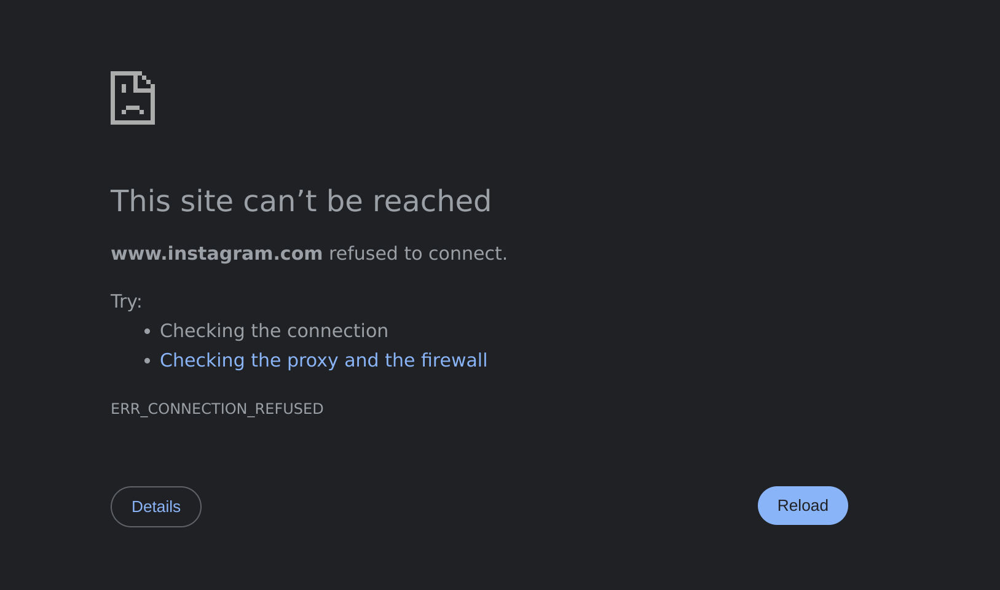

Comprender el **DNS (Domain Name System )** es esencial para cualquier persona interesada en el funcionamiento de Internet. El DNS juega un papel crucial en la traducción de nombres de dominio legibles por el ser humano a direcciones IP, lo que garantiza una fluidez en la navegación web.

Esta guía le guiará a través de:

- Las **estructuras jerárquicas del DNS** y sus componentes claves.
- Los **tipos de consultas DNS** y como funcionan.
- Las **preocupaciones sobre la seguridad del DNS** y medidas de protección como **DNSSEC**.
- La **Configuración de un servidor DNS local** mediante BIND9 para la mejora del **rendimiento**, **privacidad** y el **filtrado de contenido**.

Asi que, si quiere llevar sus conocimientos al siguiente nivel y descubrir como este sistema jerárquico garantiza que cada página web que visites esté a un solo clic de distancia, sigue leyendo.

<!-- more -->

## **Lo básico: ¿Qué Hace Un DNS?**

Cuando introduces un nombre de dominio en tu navegador, el ordenador no entiende ese nombre directamente. En su lugar, tu dispositivo inicia un proceso llamado **resolución de nombre** (**domain resolution**) para encontrar la dirección IP correspondiente. Los servidores DNS se encargan de esta resolución mediante un sistema estructurado y jerárquico.

## **La Jerarquía de los Servidores DNS**

<figure markdown="span">
    { width="550" }
    <figcaption>Jerarquía de Servidores DNS para Google</figcaption>
</figure>

El DNS opera como un **sistema jerárquico distribuido**. Cada nivel en esta jerarquía juega un papel específico en la traducción de nombres de dominio en direcciones IP. Así es como funciona:

#### **Resolución Recursiva (La Consulta DNS Comienza Aquí)**

- Cuando escribes una URL en tu navegador, tu dispositivo manda una petición a un **servidor DNS recursivo** (**recursive resolver**). Este suele estar proporcionado por su proveedor de servicios de Internet (ISP) or un servicio de terceros como Google Public DNS o Cloudflare.
- El trabajo del servidor DNS recursivo consiste en gestionar su consulta y obtener la dirección IP correcta poniéndose en contacto con otros servidores DNS en su nombre.

#### **Servidores DNS Raíz (El Punto de Partida)**

- Si el servidor DNS recursivo no tiene todavía la dirección IP en caché, contacta con uno de los **13 servidores DNS raíz** que están distribuidos globalmente.
- Estos servidores no almacenan mapeos específicos de dominio a IP, sino que apuntan al siguiente nivel en la jerarquía: **Servidores de Dominio de Nivel Superior (TLD)**.

#### **Top-Level Domain (TLD) Servers**

- Los servidores TLD gestionan los dominios en función de su sufijo, como `.com`, `.org`, o `.net`. Por ejemplo, si estás visitando `google.com`, el servidor raíz dirigirá su consulta al servidor TLD `.com`.
- El servidor TLD proporciona entonces la dirección del **servidor de nombres autoritativo** para el dominio solicitado.

#### **Servidores de Nombres Autoritativo**
- El servidor de nombres autoritativo es el último paso de la cadena. **Contiene los registros DNS reales** para el dominio, incluyendo la dirección IP del servidor web.
- En el caso de Google, si buscas `google.com`, el servidor autorizado devolverá la dirección IP correspondiente (por ejemplo, `8.8.8.8`).

#### **Devolución de la Respuesta**

- Una vez que el servidor DNS recursivo consigue la dirección IP del servidor autoritativo, la devuelve a tu navegador. Entonces, tu navegador puede utilizar la dirección IP para conectarse al servidor web y cargar la página.

#### **Tipos de Consultas DNS**

Durante este proceso, hay tres tipos principales de consultas DNS:

1. **Consultas Recursivas:** El servidor DNS recursivo asume toda la responsabilidad de encontrar la dirección IP y devolvérsela al cliente.
2. **Consultas Iterativas:** El servidor DNS recursivo consulta cada servidor DNS en secuencia, recibiendo referencias al siguiente servidor hasta que encuentra la dirección IP.
3. **Consultas No Recursivas:** Si el servidor DNS recursivo ya tiene la información en caché, devuelve inmediatamente el resultado.

## **Registros DNS: Componentes Básicos**

El servidor de nombres autoritativo almacena los diferentes tipos de **registros DNS** que contienen información específica acerca del dominio.
Algunos de los registros más comunes son:
- **Registro A:** Asigna un dominio a una dirección IPv4.
- **Registro AAAA:** Asigna un dominio a una dirección IPv6.
- **Registro CNAME:** Apunta un dominio a otro (utilizado para alias).
- **Registro MX:** Especifica los servidores de correo para la entrega de correo electrónico.
- **Registro TXT:** Proporciona información adicional sobre un dominio, a menudo utilizado para verificación.

## **Caché DNS: Acelerando las cosas**

Para mejorar el rendimiento y reducir la carga de los servidores DNS, se utiliza el almacenamiento en caché a varios niveles:

- **Caché del navegador:** Tu navegador almacena temporalmente las respuestas DNS de los dominios que visitas con frecuencia.
- **Caché del Sistema Operativo:** El sistema operativo de tu dispositivo también almacena en caché las respuestas DNS para evitar consultas redundantes.
- **Caché del servidor DNS recursivo:** El servidor DNS recursivo mantiene una caché de los dominios consultados recientemente para acelerar futuras búsquedas.

El almacenamiento en caché garantiza que la mayoría de las consultas DNS no tengan que atravesar toda la jerarquía, haciendo que la búsqueda en Internet sea más rápida y eficiente.

Para observar cómo el almacenamiento en caché de DNS reduce el tiempo de respuesta, vamos a utilizar el comando **dig** prestando atención al ***Query Time*** para el dominio **google**:

En la primera prueba obtuvimos:

``` bash
; <<>> DiG 9.18.28-1~deb12u2-Debian <<>> google.com
;; global options: +cmd
;; Got answer:
;; ->>HEADER<<- opcode: QUERY, status: NOERROR, id: 25335
;; flags: qr rd ra; QUERY: 1, ANSWER: 1, AUTHORITY: 0, ADDITIONAL: 1

;; OPT PSEUDOSECTION:
; EDNS: version: 0, flags:; udp: 1232
;; QUESTION SECTION:
;google.com.                    IN      A

;; ANSWER SECTION:
google.com.             215     IN      A       142.250.200.142

;; Query time: 68 msec
```

Y en la segunda prueba:

```bash
; <<>> DiG 9.18.28-1~deb12u2-Debian <<>> google.com
;; global options: +cmd
;; Got answer:
;; ->>HEADER<<- opcode: QUERY, status: NOERROR, id: 44597
;; flags: qr rd ra; QUERY: 1, ANSWER: 1, AUTHORITY: 0, ADDITIONAL: 1

;; OPT PSEUDOSECTION:
; EDNS: version: 0, flags:; udp: 1232
;; QUESTION SECTION:
;google.com.                    IN      A

;; ANSWER SECTION:
google.com.             287     IN      A       142.250.200.78

;; Query time: 36 msec
```

Como podemos ver, el tiempo ha decrementado.

## **Seguridad del DNS**

A pesar de su importancia, el sistema DNS tiene vulnerabilidades que pueden ser explotadas por los atacantes. Algunos problemas comunes incluyen:

- **DNS Spoofing/Poisoning:** Los actores maliciosos inyectan registros DNS falsos en la caché, redirigiendo a los usuarios a páginas web fraudulentas.
- **Ataques DDoS:** Este es uno de los ataques más conocidos que consiste en inundar el servidor DNS con tráfico para interrumpir el servicio.
- **Ataques Man-in-the-Middle:** Consiste en interceptar consultas DNS para modificar sus respuestas.

Para combatir estas amenazas, tecnologías como **DNSSEC (Domain Name System Security Extensions)** añade firmas criptográficas a los registros DNS, garantizando su autenticidad. Imagina que quieres visitar google.com:

1. Tu navegador solicita la dirección IP para google.com desde el servidor DNS recursivo.
2. El servidor DNS recursivo comprueba las firmas DNSSEC en cada nivel (root, .com, and google.com).
3. Si todas las firmas son válidas, el servidor DNS recursivo devuelve la dirección IP.
4. Si alguna de las firmas falla, el servidor DNS recursivo sabe que los datos han sido manipulados y los descarta.

## **Configurar un servidor DNS local por motivos de Privacidad y Rendimiento**

Si has llegado hasta aquí, ¡enhorabuena! Ya conoces los principios básicos y claves de los servidores DNS. Con este conocimiento, estás preparado para ponerte manos a la obra y configurar tu propio servidor DNS local. Hacerlo te abre un mundo de posibilidades: puedes filtrar contenido no deseado en tu red, mejorar el rendimiento de la navegación e incluso navegar por internet de manera segura, minimizando el riesgo de virus y otras amenazas online.

### Bind9

En este articulo, utilizaremos el **servidor DNS BIND9** para configurar un servidor DNS directamente en nuestro ordenador. Este enfoque práctico nos permitirá experimentar cómo es tener un servidor DNS completamente funcional ejecutándose en nuestra propia red, ¡desde la comodidad de nuestra propia máquina!

Primero, vamos a instalar **bind9**:

```bash
sudo apt update
sudo apt install bind9 dnsutils
```

Configuramos nuestro sistema para que primero pregunte al servidor DNS local que nos hemos instalado:

```bash
sudo nano /etc/resolv.conf
```

Añadimos el servidor local como primera línea:

```bash
nameserver 127.0.0.1
```

Después, editaremos el archivo de configuración:

```bash
sudo nano /etc/bind/named.conf.options
```

Elimina todo lo que contiene dicho archivo y añade lo siguiente:

```bash
acl "trusted" {
    192.168.0.0/16;
    localhost;
};

options {
    directory "/var/cache/bind";

    recursion yes;
    allow-query { trusted; };

    forwarders {
        1.1.1.3;
        1.1.1.2;
    };

    dnssec-validation auto;

    listen-on { any; };
    listen-on-v6 { any; };
};
```

Esta **ACL especifica qué clientes son considerados "de confianza"** y pueden interactuar con el servidor DNS.

El bloque de opciones contiene ajustes globales para el servidor BIND9. Vamos a repasar cada línea:

- `directory "/var/cache/bind";` Especifica el directorio donde BIND almacenará su caché y archivos relacionados.

- `recursion yes;` Habilita las consultas recursivas, lo que significa que el servidor resolverá las consultas DNS en nombre de los clientes consultado otros servidores DNS si no tiene la respuesta en caché o localmente configurada.

- `allow-query { trusted; };` Restringe qué clientes pueden enviar consultas al servidor. Solo los clientes definidos en la ACL de confianza (red local y localhost) pueden realizar consultas al servidor DNS.

- `forwarders { 1.1.1.3; 1.1.1.2; };` Define los servidores DNS externos (en este caso, los servidores DNS filtrados de Cloudflare) a los que el servidor reenviará las consultas que no puede resolver localmente. El servidor actúa como un intermediario, reenviando consultas no resueltas a estos servidores upstream.
    - 1.1.1.3: Bloquea el contenido malicioso.
    - 1.1.1.2: Bloquea contenido relacionado con malware.

- `dnssec-validation auto;` Habilita la validación DNSSEC automáticamente, garantizando la autenticidad y la integridad de las respuestas del DNS usando firmas criptográficas.

Con esta configuración, hemos implementado medidas básicas de seguridad confiando en los servidores DNS de Cloudflare para gestionar las consultas reenviadas, garantizando que las respuestas están filtradas para **evitar dominios maliciosos**.

Podemos comprobar nuestra mejora de rendimiento haciendo lo mismo que antes, utilizando el comando **dig** para buscar el ***Query Time*** del dominio **google.com**.

```bash
; <<>> DiG 9.18.28-1~deb12u2-Debian <<>> google.com
;; global options: +cmd
;; Got answer:
;; ->>HEADER<<- opcode: QUERY, status: NOERROR, id: 56385
;; flags: qr rd ra; QUERY: 1, ANSWER: 1, AUTHORITY: 0, ADDITIONAL: 1

;; OPT PSEUDOSECTION:
; EDNS: version: 0, flags:; udp: 1232
; COOKIE: 2b2a789af74949000100000067966b06329ed55c149fd975 (good)
;; QUESTION SECTION:
;google.com.                    IN      A

;; ANSWER SECTION:
google.com.             300     IN      A       142.250.200.142

;; Query time: 67 msec
;; SERVER: 127.0.0.1#53(127.0.0.1) (UDP)
;; MSG SIZE  rcvd: 83
```

Después de la segunda consulta, conseguimos un tiempo de respuesta de **0ms**, ya que nuestro servidor DNS local recupera eficazmente el resultado de su caché.

```bash
; <<>> DiG 9.18.28-1~deb12u2-Debian <<>> google.com
;; global options: +cmd
;; Got answer:
;; ->>HEADER<<- opcode: QUERY, status: NOERROR, id: 51691
;; flags: qr rd ra; QUERY: 1, ANSWER: 1, AUTHORITY: 0, ADDITIONAL: 1

;; OPT PSEUDOSECTION:
; EDNS: version: 0, flags:; udp: 1232
; COOKIE: a2419e6c5e03859d0100000067966b096b0ad0c0a30e2273 (good)
;; QUESTION SECTION:
;google.com.                    IN      A

;; ANSWER SECTION:
google.com.             297     IN      A       142.250.200.142

;; Query time: 0 msec
;; SERVER: 127.0.0.1#53(127.0.0.1) (UDP)
;; MSG SIZE  rcvd: 83
```

Podemos ver que el SERVER al que estamos preguntando es `127.0.0.1`ya que es nuestro servidor DNS **bind9**.

Sin embargo, ¿y si queremos ir un paso más allá y aplicar nuestras propias restricciones? Ya sea para mejorar la seguridad, bloquear sitios webs específicos o crear un entorno de Internet más seguro para los niños, podemos configurar BIND9 para restringir el acceso a una lista personalizada de dominios. Esto nos da un control total sobre qué contenido está o no permitido en nuestra red, adaptando el servidor DNS para satisfacer nuestras necesidades específicas.

### Bloqueo de dominios específicos usando BIND9


Para bloquear dominios específicos utilizando BIND9, podemos crear un **archivo de zona personalizado** que redirigirá las consultas de aquellos dominios a una dirección no válida o inexistente, bloqueando así el acceso. 

Aquí tienes una guía paso a paso:

#### Crear un archivo de Zona para bloquear dominios

Un archivo de zona define los registros DNS para los dominios que quieras bloquear. Estos registros pueden redirigir los dominios bloqueados a un <<agujero negro\>\> (por ejemplo, `127.0.0.1` o `0.0.0.0`).


1.  Cree un archivo de zona para los dominios bloqueados, por ejemplo, `block_instagram.zone`:
  ```bash
  sudo nano /etc/bind/block_instagram.zone
  ```

2.  Añade lo siguiente al contenido del archivo de zona:
  ```bash
  $TTL    3600
  @       IN      SOA     localhost. root.localhost. (
                  2025012601 ; Serial
                  3600       ; Refresh
                  1800       ; Retry
                  604800     ; Expire
                  86400 )    ; Minimum TTL
          IN      NS      localhost.

  @       IN      A       127.0.0.1
  *       IN      A       127.0.0.1
  ```
    - **`127.0.0.1`**: Redirige las consultas de los dominios bloqueados a la máquina local, impidiendo efectivamente el acceso.
    - **Registro Comodín (`* IN A`)**: Garantiza que cualquier subdominio de los dominios bloqueados también sean redirigidos.

#### Defina los Dominios Bloqueados en `named.conf.local`

Vamos a bloquear **Instagram**. Es necesario asociar el dominio bloqueado con el archivo de zona personalizado.

1. Abre el archivo de configuración de BIND9
```bash
sudo nano /etc/bind/named.conf.local
```
2. Añade una entrada `zone` a cada dominio que quieras bloquear. En este caso bloquearemos ***instagram.com*** y ***cdninstagram.com***, el dominio de la red de la distribución de contenidos (CDN) de Instagram que se utiliza para servir imágenes y videos:
```bash
zone "instagram.com" {
    type master;
    file "/etc/bind/block_instagram.zone";
};

zone "cdninstagram.com" {
    type master;
    file "/etc/bind/block_instagram.zone";
};
```

#### Recargar la Configuración de BIND9

Una vez que hayas creado el archivo de zona y actualizado la configuración, recarga el servicio BIND9 para aplicar los cambios.

1. Comprueba si hay errores en la configuración:
```bash
sudo named-checkconf
```

2. Recarga el servicio BIND9:
```bash
sudo systemctl reload bind9
```

### **Prueba la Configuración**

Para verificar que los dominios bloqueados funcionan como se espera:

1. Utiliza el comando `dig` para consultar el dominio bloqueado:
```bash
dig instagram.com.
```
    - La respuesta debería de devolver `127.0.0.1`.


2.  Intente acceder al dominio bloqueado desde el navegador. No debería de cargarse.

<figure markdown="span">
    { width="600" }
  <figcaption>Instagram no está Disponible</figcaption>
</figure>

Al crear un archivo de zona personalizado y asociarlo a los dominios que deseas bloquear, obtenemos un control total sobre las restricción de acceso a ciertos sitios web. Esta configuración nos permite:

  - Mejorar la seguridad bloqueando dominios maliciosos conocidos.
  - Personalizar el servidor DNS para satisfacer los requisitos específicos de la red.

## Conclusion

Ahora, ya sabes como bloquear cualquier dominio al que no quieras que accedan tus familiares o los usuarios de la red. Ya sea para limitar el acceso a las redes sociales para ayudar a tus hijos a concentrarse, para mejorar la seguridad bloqueando sitios web maliciosos o simplemente para tener control de tu propia red, ahora tienes las herramientas para conseguirlo.

Este ejemplo se realizó en un portátil local, pero no tiene porque detenerse ahí. Puedes implementar la misma configuración a **nivel de router** o usar una **Raspberry Pi** como tu servidor DNS primario. De esta manera, puedes aplicar estas reglas a toda tu red, garantizando que todos los dispositivos conectados siguen tus restricciones personalizadas.

Con este enfoque, no solo estás gestionando un servidor DNS, estás creando un **entorno digital más seguro y productivo** para todos los miembros de tu red.

Stay safe. Stay smart. Stay secure.

---