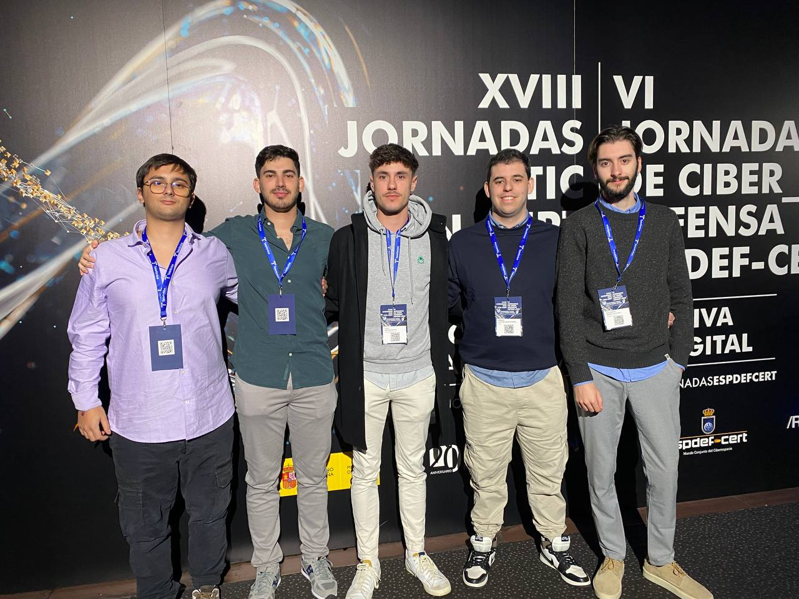

# XVIII Jornadas STIC CCN-CERT | VI Jornadas de Ciberdefensa ESPDEF-CERT

El pasado Martes, tuvimos el honor de asistir a la [**XVIII Jornadas STIC CCN-CERT | VI Jornadas de Ciberdefensa ESPDEF-CERT**](https://jornadas.ccn-cert.cni.es/es/xviiijornadas){:target="_blank"}, celebradas en los cines Kinépolis de la Ciudad de la Imagen en Madrid. El propósito principal de este viaje fue recibir un premio concedido a nuestro equipo de ciberseguridad, que resultó ganador de una competición nacional organizada por la Universidad de Granada en colaboración con [**El Mando Conjunto del Ciberespacio (MCCE)**](https://youtu.be/w7iuEEjaLYU){:target="_blank"} y el [**Instituto Nacional de Ciberseguridad (INCIBE)**](https://www.incibe.es/){:target="_blank"}. Este reconocimiento no solo nos llena de orgullo, si no que también refuerza nuestro compromiso con las nuevas generaciones y nuestra confianza en el inmenso talento de estos jóvenes profesionales.

<!-- more -->

Además, aprovechamos nuestro tiempo en este importante evento para empezar a hacernos un hueco en el sector, estableciendo conexiones con otras empresas, aprendiendo de las experiencias y siendo asesorados por organizaciones líderes en el panorama tecnológico tanto a nivel nacional como internacional.

Estamos convencidos de que este es el camino correcto, y salimos de Madrid con un gran entusiasmo para ayudar a todas las empresas que confían en nosotros para alcanzar la excelencia.

\#XVIIIJORNADASCCNCERT
\#VIJORNADASESPDEFCERT

<figure markdown="span">
    
      <figcaption>Nuestro equipo en el photocall</figcaption>
</figure>

Stay safe. Stay smart. Stay secure.

---